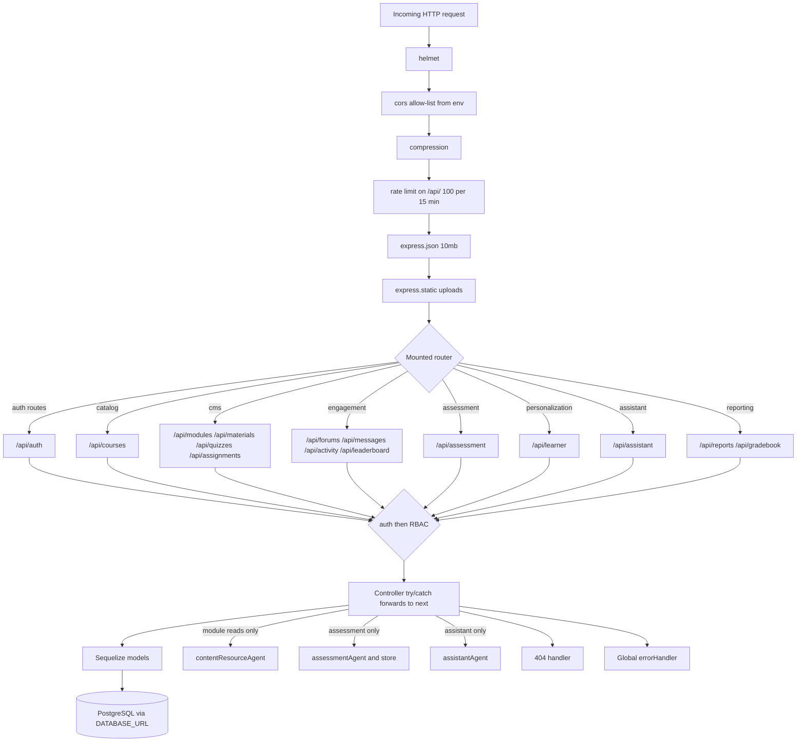
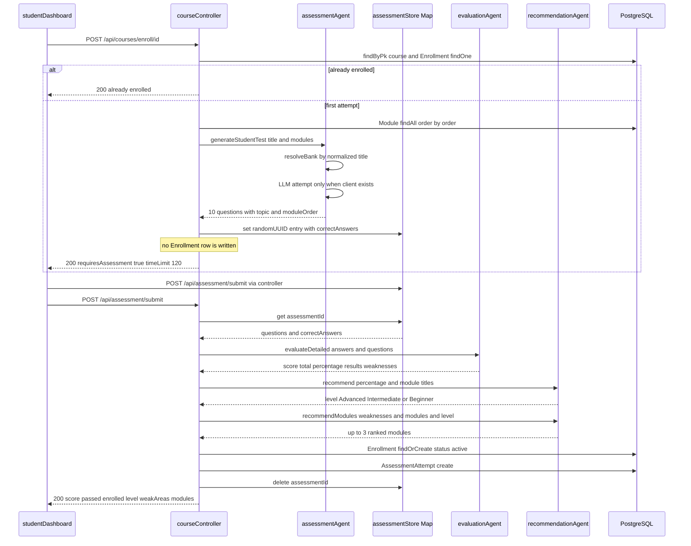
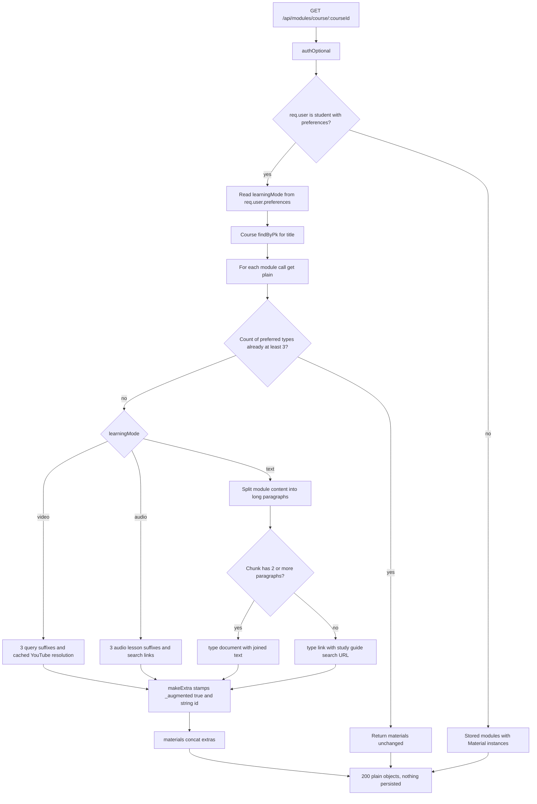
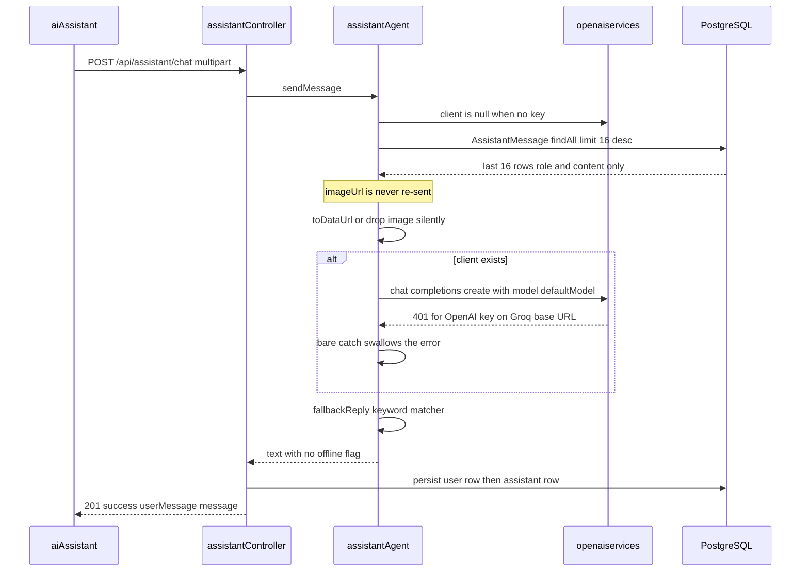
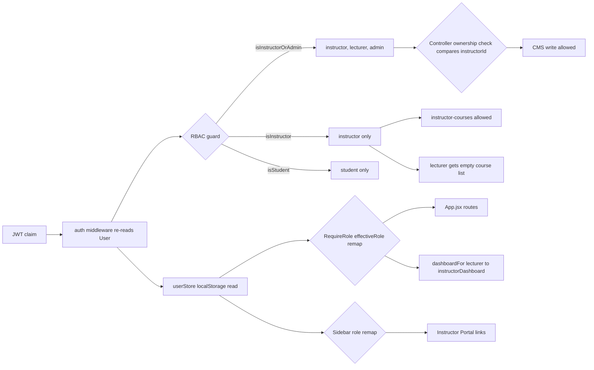
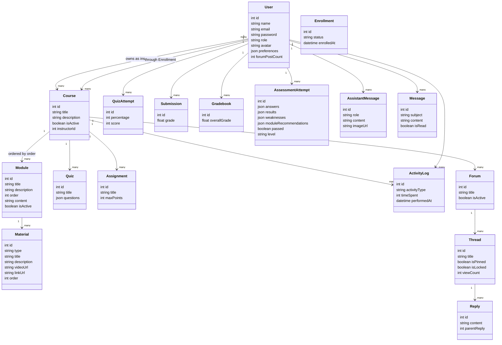

# EduFlow — As-Built Implementation

This document describes how EduFlow is **actually implemented today**, not how it was
originally specified. Every route, constant, payload field and formula below was read out of
the source; `file:line` references are included so each claim can be checked. Where the code
contradicts its own comments, an earlier draft of the documentation, or `backend/AGENTS.md`,
the code wins and the discrepancy is recorded in [§13](#13-defect-register).

**Evidence standard used throughout**

| Mark | Meaning |
| --- | --- |
| ✅ verified | Read directly from source in this pass, with a `file:line` citation |
| ⚠️ derived | Followed by reading code paths; no request was executed against a live server |
| ❌ unconfirmed | Depends on runtime/environment state not visible in the repository |

No API request and no browser session was executed while writing this document, so every
statement about runtime behaviour is a close reading of code, not an observation.

## Contents

1. [Runtime topology and bootstrap](#1-runtime-topology-and-bootstrap)
2. [Authentication, authorization and the role model](#2-authentication-authorization-and-the-role-model)
3. [Backend route map](#3-backend-route-map)
4. [Content management (courses, modules, materials, quizzes, assignments)](#4-content-management-courses-modules-materials-quizzes-assignments)
5. [Content and resource agent](#5-content-and-resource-agent)
6. [Placement assessment and enrollment gate](#6-placement-assessment-and-enrollment-gate)
7. [Learner model](#7-learner-model)
8. [Interactive engagement](#8-interactive-engagement)
9. [AI assistant (Ifeanyi)](#9-ai-assistant-ifeanyi)
10. [Frontend wiring](#10-frontend-wiring)
11. [Environment configuration](#11-environment-configuration)
12. [Data flow diagrams](#12-data-flow-diagrams)
13. [Defect register](#13-defect-register)
14. [What this document does not cover](#14-what-this-document-does-not-cover)

Companion documents: [`requirements.md`](./requirements.md) (104 functional + 54
non-functional requirements) and [`uml.md`](./uml.md) (nine Mermaid views).

---

## 1. Runtime topology and bootstrap

### 1.1 Stack as configured

| Layer | Technology | Evidence |
| --- | --- | --- |
| API | Node.js, CommonJS, Express 4 | `backend/server.js:1-33` |
| ORM | Sequelize 6 | `backend/config/database.js:1-24` |
| Database | **PostgreSQL** via `DATABASE_URL`, SSL required | `backend/config/database.js:3-16` |
| Auth | JWT (`jsonwebtoken`) + `bcryptjs` | `backend/middleware/auth.js:1-28` |
| Uploads | `multer` disk storage | `backend/middleware/upload.js:17-57` |
| Hardening | `helmet`, `cors`, `compression`, `express-rate-limit` | `backend/server.js:36-78` |
| Frontend | React 19 + Vite + React Router + Tailwind | `frontend/src/App.jsx`, `frontend/vite.config.js` |
| Deployment | Vercel serverless (backend), static SPA (frontend) | `backend/server.js:156-158` |

> **Correction to `backend/AGENTS.md`.** That file states the backend targets "MySQL
> (mysql2) or SQLite (sqlite3), switched purely via `DB_DIALECT`". The code has no
> `DB_DIALECT`, no `mysql2` and no `sqlite3`; `config/database.js:4` hardcodes
> `dialect: 'postgres'` and reads a single `DATABASE_URL`. Treat the `AGENTS.md` database
> paragraph as stale — see [§13, D-14](#13-defect-register).

### 1.2 Database connection

`backend/config/database.js:3-24` creates the Sequelize instance at require time:

- `new Sequelize(process.env.DATABASE_URL, { dialect: 'postgres' })` — the URL alone selects
  the database; there is no host/user/password branching.
- `dialectOptions.ssl = { require: true, rejectUnauthorized: false }` — TLS is mandatory and
  certificate verification is **disabled**.
- `pool.max = process.env.VERCEL === '1' ? 1 : 5`.
- `logging` is `console.log` in development, `false` otherwise.

`connectDB()` (`:26-39`) awaits `sequelize.authenticate()` then `sequelize.sync()` — note
`sync()` with **no** `{ alter: true }`, so schema changes are create-only. Any connection
failure is rethrown after logging, which prevents the listen step from running.

### 1.3 Middleware chain order

Order matters and is fixed in `backend/server.js`:

1. `helmet()` — `:36`
2. `cors(...)` — `:59-67`. Origins are assembled from `CLIENT_URL`, `CLIENT_URLS`,
   `FRONTEND_URL`, `FRONTEND_URLS`, `CORS_ORIGIN`, `CORS_ORIGINS` (`:46-57`), each split on
   `,` and normalized by `normalizeOrigin` (`:39-44`), which prefixes a bare hostname with
   `https://` and `localhost[:port]` with `http://`. `credentials: true`,
   `optionsSuccessStatus: 204`. If the resulting allow-list is empty or contains `*`, every
   origin is accepted (`:62`).
3. `compression()` — `:70`
4. `rateLimit` on `/api/` — `:73-78`. Window `RATE_LIMIT_WINDOW_MS` (default 15 min), max
   `RATE_LIMIT_MAX_REQUESTS` (default 100), `message` is a bare **string**, not
   `{ message }` — see [§13, D-20](#13-defect-register).
5. `express.json({ limit: '10mb' })` and `express.urlencoded({ extended: true, limit: '10mb' })` — `:81-82`
6. `express.static('uploads')` mounted at `/uploads` — `:85` (hardcoded directory name)
7. 17 route mounts under `/api/...` — `:88-104`
8. `GET /api/health` — `:107-113`, returns `{ success: true, message: 'Server is running', timestamp }`
9. `GET /` advertisement — `:116-139`
10. 404 handler — `:142-147`, `{ success: false, message: 'Route not found' }`
11. Global `errorHandler` — `:150`

### 1.4 Boot and the serverless fork

```js
connectDB().then(() => {
  if (process.env.VERCEL === '1') return;          // server.js:158
  const server = app.listen(PORT, () => { ... });  // :160-162
  process.on('unhandledRejection', (err) => {      // :165-168
    console.error(...);
    server.close(() => process.exit(1));
  });
});
```

`PORT` defaults to `5000`. The Vercel branch never binds a port: Vercel serves the
`module.exports = app` object (`server.js:171`) directly. Consequence: the `unhandledRejection`
handler is registered **only** on the standalone path, so a serverless invocation has no
process-level crash guard.

---

## 2. Authentication, authorization and the role model

### 2.1 `auth` — strict authentication

`backend/middleware/auth.js:8-28`:

1. Reads `Authorization` and strips the literal prefix `'Bearer '`.
2. Absent token → `401 { message: 'No authentication token, access denied' }`.
3. `jwt.verify(token, process.env.JWT_SECRET)`.
4. `User.findByPk(decoded.id)` — the user is re-read from the database on **every** request,
   so a deleted or deactivated account cannot use an unexpired token.
5. Missing user → `401 { message: 'User not found' }`.
6. Assigns the **full Sequelize instance** to `req.user` (not a plain object), then `next()`.
7. Any throw → `401 { message: 'Token is not valid' }`.

Because `req.user` is a model instance, `req.user.preferences.learningMode`
(`controllers/moduleController.js:21-24`) is a live JSON read and
`req.user.id` is the numeric primary key.

### 2.2 `auth.authOptional` — soft authentication

`backend/middleware/auth.js:38-50`, attached as a property on the exported function
(`:52`). It mirrors the strict path but **never rejects**: a missing token, an invalid
token, or an unknown user all fall through to `next()` with `req.user` unset. Used only on
the two module read routes so that a signed-in student gets a personalized payload while
anonymous and staff callers still get the plain catalogue.

### 2.3 Role guards

`backend/middleware/rbac.js:6-20` defines `authorize(...roles)`: `401` when `!req.user`,
`403 { message: 'Access denied. Insufficient permissions' }` when the role is not in the
list, otherwise `next()`. The exported guards and their admitted roles:

| Export | Roles admitted | Line |
| --- | --- | --- |
| `isInstructorOrAdmin` | `instructor`, `lecturer`, `admin` | `:22` |
| `isAdmin` | `admin` | `:23` |
| `isInstructor` | `instructor` | `:24` |
| `isLecturer` | `lecturer` | `:25` |
| `isInstructorOrLecturer` | `instructor`, `lecturer` | `:26` |
| `isLecturerOrAdmin` | `lecturer`, `admin` | `:27` |
| `isStudent` | `student` | `:28` |

**`isInstructorOrAdmin` admitting `lecturer` is the single most consequential asymmetry in
the codebase.** Any route gated with `isInstructor` rejects a lecturer even though the same
lecturer passes `isInstructorOrAdmin` and owns the course. This produces the visible
consistency-screen failure in [§13, D-09](#13-defect-register).

A second layer of ownership checks lives inside the CMS controllers and compares
`course.instructorId !== req.user.id && req.user.role !== 'admin'`
(`moduleController.js:95-97`, `:133-135`, `:163-165`). These run *after* RBAC, so they are
the only thing preventing one instructor from editing another instructor's course.

### 2.4 Four notions of "is a lecturer an instructor"

| Location | Rule | Effect on `lecturer` |
| --- | --- | --- |
| `backend/middleware/rbac.js:22-25` | `isInstructorOrAdmin` includes it, `isInstructor` does not | Passes CMS writes, fails `instructor-courses` |
| `frontend/src/App.jsx:46` | `effectiveRole = user.role === 'lecturer' ? 'instructor' : user.role` | Guarded routes see `instructor` |
| `frontend/src/component/sidebar.jsx:73-75` | identical remap, duplicated | Lecturer sees "Instructor Portal" and instructor nav links |
| `frontend/src/App.jsx:26-29` | `dashboardFor('lecturer') === '/instructorDashboard'` | Consistent with the remap |

The two frontend copies are byte-identical logic in two files, and the backend has a third,
different notion. Changing role semantics requires edits in at least three places.

---

## 3. Backend route map

All mounts from `backend/server.js:88-104`. "Auth" lists middleware in registration order.

### 3.1 Catalog, courses and learning path — `routes/courses.js`

| Method | Path | Auth | Handler |
| --- | --- | --- | --- |
| GET | `/api/courses` | — | `getAllCourses` (`:18`) |
| GET | `/api/courses/my-courses` | `auth` | `getMyCourses` (`:19`) |
| GET | `/api/courses/instructor-courses` | `auth, isInstructor` | `getInstructorCourses` (`:20`) |
| GET | `/api/courses/:id/learning-path` | `auth` | `getLearningPath` (`:21`) — **broken, see [D-01](#13-defect-register)** |
| GET | `/api/courses/:id` | — | `getCourseById` (`:22`) |
| POST | `/api/courses/enroll/:id` | `auth` | `enrollCourse` (`:25`) |
| POST | `/api/courses` | `auth, isInstructorOrAdmin` | `createCourse` (`:28`) |
| PUT | `/api/courses/:id` | `auth, isInstructorOrAdmin` | `updateCourse` (`:29`) |
| DELETE | `/api/courses/:id` | `auth, isInstructorOrAdmin` | `deleteCourse` (`:30`) |

### 3.2 Modules — `routes/modules.js`

| Method | Path | Auth | Handler |
| --- | --- | --- | --- |
| GET | `/api/modules/course/:courseId` | `authOptional` | `getModules` (`:14`) — **augments for students** |
| GET | `/api/modules/:id` | `authOptional` | `getModuleById` (`:15`) — **does not augment** |
| POST | `/api/modules/course/:courseId` | `auth, isInstructorOrAdmin` | `createModule` (`:18`) |
| PUT | `/api/modules/:id` | `auth, isInstructorOrAdmin` | `updateModule` (`:19`) |
| DELETE | `/api/modules/:id` | `auth, isInstructorOrAdmin` | `deleteModule` (`:20`) |

### 3.3 Materials — `routes/materials.js`

| Method | Path | Auth | Handler |
| --- | --- | --- | --- |
| GET | `/api/materials/module/:moduleId` | — | `getMaterials` (`:15`) |
| GET | `/api/materials/:id` | — | `getMaterialById` (`:16`) |
| POST | `/api/materials/module/:moduleId` | `auth, isInstructorOrAdmin, upload.single('file')` | `createMaterial` (`:19`) |
| PUT | `/api/materials/:id` | `auth, isInstructorOrAdmin, upload.single('file')` | `updateMaterial` (`:20`) |
| DELETE | `/api/materials/:id` | `auth, isInstructorOrAdmin` | `deleteMaterial` (`:21`) |

Both material reads are fully public, so catalogue content is readable anonymously.

### 3.4 Quizzes — `routes/quizzes.js`

| Method | Path | Auth |
| --- | --- | --- |
| GET | `/api/quizzes/course/:courseId` | — |
| GET | `/api/quizzes/my-attempts` | `auth` |
| POST | `/api/quizzes/:quizId/submit` | `auth` |
| GET | `/api/quizzes/:id` | — |
| POST | `/api/quizzes/course/:courseId` | `auth, isInstructorOrAdmin` |
| PUT | `/api/quizzes/:id` | `auth, isInstructorOrAdmin` |
| DELETE | `/api/quizzes/:id` | `auth, isInstructorOrAdmin` |
| GET | `/api/quizzes/:quizId/attempts` | `auth, isInstructorOrAdmin` |

Registration order here is correct: the two literal paths precede `/:id`.

### 3.5 Assignments — `routes/assignments.js`

| Method | Path | Auth | Line |
| --- | --- | --- | --- |
| GET | `/api/assignments/course/:courseId` | — | `:19` |
| GET | `/api/assignments/:id` | — | `:20` |
| POST | `/api/assignments/:assignmentId/submit` | `auth, upload.array('files', 5)` | `:23` |
| GET | `/api/assignments/my-submissions` | `auth` | `:24` — **shadowed, see [D-02](#13-defect-register)** |
| POST | `/api/assignments/course/:courseId` | `auth, isInstructorOrAdmin, upload.array('attachments', 5)` | `:27` |
| PUT | `/api/assignments/:id` | `auth, isInstructorOrAdmin, upload.array('attachments', 5)` | `:28` |
| DELETE | `/api/assignments/:id` | `auth, isInstructorOrAdmin` | `:29` |
| GET | `/api/assignments/:assignmentId/submissions` | `auth, isInstructorOrAdmin` | `:30` |
| PUT | `/api/assignments/submissions/:submissionId/grade` | `auth, isInstructorOrAdmin` | `:31` |

### 3.6 Forums — `routes/forums.js`

| Method | Path | Auth |
| --- | --- | --- |
| GET | `/api/forums/course/:courseId` | — |
| GET | `/api/forums/:forumId/threads` | — |
| GET | `/api/forums/threads/:id` | — |
| POST | `/api/forums/:forumId/threads` | `auth` |
| POST | `/api/forums/threads/:threadId/replies` | `auth` |
| POST | `/api/forums/course/:courseId` | `auth, isInstructorOrAdmin` |
| PUT | `/api/forums/threads/:id/pin` | `auth, isInstructorOrAdmin` |
| PUT | `/api/forums/threads/:id/lock` | `auth, isInstructorOrAdmin` |

All three read routes are anonymous-readable. `/threads/:id` does not collide with
`/:forumId/threads` because the second segment must be the literal `threads`.

### 3.7 Messaging, activity, leaderboard, assistant, learner

| Method | Path | Auth |
| --- | --- | --- |
| GET | `/api/messages` | `auth` |
| GET | `/api/messages/users` | `auth` |
| GET | `/api/messages/unread-count` | `auth` |
| GET | `/api/messages/:id` | `auth` |
| POST | `/api/messages` | `auth` |
| POST | `/api/messages/:id/reply` | `auth` |
| PUT | `/api/messages/:id/read` | `auth` |
| DELETE | `/api/messages/:id` | `auth` |
| POST | `/api/activity` | `auth` |
| GET | `/api/activity/my` | `auth` |
| GET | `/api/leaderboard` | `auth, authorize('student','instructor','lecturer','admin')` |
| POST | `/api/assistant/chat` | `auth, isStudent, upload.uploadAvatar.single('image')` |
| GET | `/api/assistant/history` | `auth, isStudent` |
| GET | `/api/learner/model` | `auth, isStudent` |
| GET | `/api/learner/recommendations` | `auth, isStudent` |
| GET | `/api/learner/insights` | `auth, isStudent` |
| PUT | `/api/learner/preferences` | `auth, isStudent` |

Messaging has **no** role restriction: any authenticated user may message any other by
email, with no enrollment or course scoping.

### 3.8 Assessment, gradebook, reports, settings, admin

| Method | Path | Auth |
| --- | --- | --- |
| POST | `/api/assessment/start` | `auth` |
| POST | `/api/assessment/submit` | `auth` |
| POST | `/api/assessment/evaluate` | `auth` |
| POST | `/api/assessment/recommend` | `auth` |
| GET | `/api/gradebook/my-grades` | `auth` |
| GET | `/api/gradebook/cgpa` | `auth` |
| GET | `/api/gradebook/course/:courseId` | `auth` |
| PUT | `/api/gradebook/:id` | `auth, isInstructorOrAdmin` |
| POST | `/api/gradebook/course/:courseId/calculate` | `auth, isInstructorOrAdmin` |
| GET | `/api/reports/courses/:courseId/enrollment` | `auth, isInstructorOrAdmin` |
| GET | `/api/reports/courses/:courseId/progress` | `auth, isInstructorOrAdmin` |
| GET | `/api/reports/courses/:courseId/participation` | `auth, isInstructorOrAdmin` |
| GET | `/api/reports/courses/:courseId/consistency` | `auth, isInstructorOrAdmin` |
| GET | `/api/reports/instructor/dashboard` | `auth, isInstructorOrAdmin` |
| GET | `/api/reports/admin/dashboard` | `auth, isAdmin` |
| GET/PUT | `/api/settings/me` | `auth` |
| PUT | `/api/settings/me/avatar` | `auth, upload.uploadAvatar.single('avatar')` |
| GET | `/api/admin/users`, `/users/:id` | `auth, isAdmin` |
| POST | `/api/admin/users` | `auth, isAdmin` |
| PUT/DELETE | `/api/admin/users/:id` | `auth, isAdmin` |
| PUT | `/api/admin/users/:id/toggle-status` | `auth, isAdmin` |
| GET | `/api/admin/courses` | `auth, isAdmin` |
| PUT | `/api/admin/courses/:id/assign` | `auth, isAdmin` |
| PUT | `/api/admin/courses/:id/status` | `auth, isAdmin` |

`GET /api/health` is defined inline in `server.js:107` and is not part of any router.

### 3.9 Route-ordering analysis

Express matches in registration order, so a literal path declared after a parameter path is
unreachable. Auditing all 17 routers found exactly one live collision:

| Router | Parameter route | Literal route | Status |
| --- | --- | --- | --- |
| `assignments.js` | `GET /:id` (`:20`) | `GET /my-submissions` (`:24`) | **Broken** — [D-02](#13-defect-register) |
| `quizzes.js` | `GET /:id` | `GET /my-attempts` | Correct (literal first) |
| `messages.js` | `GET /:id` | `GET /users`, `GET /unread-count` | Correct, fragile |
| `gradebook.js` | `PUT /:id` | `GET /my-grades`, `/cgpa` | Correct (no competing GET param route) |
| `forums.js` | `/:forumId/threads` | `/threads/:id` | Correct (segment shapes differ) |

---

## 4. Content management (courses, modules, materials, quizzes, assignments)

### 4.1 `getModules` — the personalization entry point

`backend/controllers/moduleController.js:10-54`:

```js
const modules = await Module.findAll({
  where: { courseId: req.params.courseId, isActive: true },
  include: [{ model: Material, as: 'materials' }],
  order: [['order', 'ASC']]
});

const learningMode =
  req.user && req.user.role === 'student' && req.user.preferences
    ? req.user.preferences.learningMode
    : null;
```

Three conditions must all hold for augmentation: a user is attached, that user's role is
**exactly** `student`, and `preferences` is truthy. An instructor, lecturer or admin
requesting the same URL always receives the stored catalogue. `Course.findByPk` runs once,
and only when `learningMode` is set (`:26-29`).

Augmentation converts each module with `module.get({ plain: true })` (`:35`), replaces
`plain.materials` with `augmentModuleMaterials(...)` (`:36-41`), and pushes plain objects.
Because `get({ plain: true })` strips the Sequelize instance, **every module in an
augmented response is a plain object, while an unauthenticated response contains model
instances** — the JSON is equivalent, but the shapes differ for any consumer that is not
serializing.

Response (`:46-50`): `{ success: true, count: payload.length, modules: payload }`.

`getModuleById` (`:60-80`) returns `{ success: true, module }` and **never** augments, even
for a student with a learning mode. A deep-link to a single module therefore shows fewer
resources of the learner's preferred type than the course view.

### 4.2 Module writes

`createModule` (`:86-117`) reads `{ title, description, order, content }` from `req.body`,
defaults `order` to `0` and `content` to `''`, and 404s when the course is missing or 403s
when the caller does not own it. `updateModule` (`:123-147`) calls `module.update(req.body)`
**with the raw body** — unlike every other handler in the codebase, which picks fields
explicitly, so a caller can attempt to overwrite `courseId`, `id` or `isActive`.
`deleteModule` (`:153-179`) destroys the module's `Material` rows first (`:168`), which is
the only cascade implemented anywhere in the project.

### 4.3 Material uploads

`backend/middleware/upload.js`:

- `uploadDir = process.env.UPLOAD_PATH || './uploads'` (`:11`), created recursively at require
  time (`:12-14`).
- Filenames are `Date.now() + '-' + random(1e9) + extname(originalname)` (`:21-24`) —
  timestamp plus random, no collision check.
- `fileFilter` (`:28-48`) allows exactly eight MIME types: `image/jpeg`, `image/png`,
  `image/gif`, `application/pdf`, `application/msword`,
  `…wordprocessingml.document`, `video/mp4`, `video/mpeg`, `audio/mpeg`. Rejections set
  `statusCode = 400`.
- `limits.fileSize = MAX_FILE_SIZE || 10 MB` (`:55`).
- `uploadAvatar` (`:72-78`) is a second multer instance restricted to four image types with
  a 5 MB cap.

The extension is taken from the client-supplied original filename while the filter validates
only the MIME type, so a mismatched pair is possible. In the Vercel deployment the write
target is the function's local filesystem, which is ephemeral and not shared between
invocations — see [§11](#11-environment-configuration).

### 4.4 Instructor CMS screen

`frontend/src/screens/instructorContent.jsx` drives four tabs from one course picker
(`api.get('/courses/instructor-courses')`, `:133`). Every tab issues three parallel GETs
(`:164-166`) for modules, quizzes and assignments. The full operation set:

| Area | Operations |
| --- | --- |
| Modules | create `POST /modules/course/:id` (`:202`), update `PUT /modules/:id` (`:199`), delete `DELETE /modules/:id` (`:216`), re-read list (`:206`) |
| Materials | create `POST /materials/module/:moduleId` (`:235`), delete `DELETE /materials/:id` (`:259`), re-read list (`:244`) |
| Assignments | create `POST /assignments/course/:courseId` (`:278`), delete `DELETE /assignments/:id` (`:297`) |
| Quizzes | create `POST /quizzes/course/:courseId` (`:323`), delete `DELETE /quizzes/:id` (`:344`) |

There are **no** material-update or quiz/assignment-update calls in this screen even though
the corresponding PUT routes exist — a real capability gap between API and UI. Ordering is
coerced with `Number(moduleForm.order)` before send (`:199`, `:202`).

---

## 5. Content and resource agent

`backend/agents/contentResourceAgent.js` powers two features: the personalized
recommendation feed and per-module augmentation.

### 5.1 Tuning constants

| Constant | Value | Line |
| --- | --- | --- |
| `MAX_RECOMMENDATIONS` | `8` | `:4` |
| `PREFERRED_SHARE` | `0.7` | `:5` |
| `DIFFICULTY_WEIGHT` | `30` | `:6` |
| `NEW_MATERIAL_WEIGHT` | `20` | `:7` |
| `ENROLLED_WEIGHT` | `10` | `:8` |
| `SEQUENCE_WEIGHT` | `10` | `:9` |
| `PREFERENCE_WEIGHT` | `25` | `:10` |
| `AUGMENT_TARGET` | `3` | `:257` |

### 5.2 Preferred type map

`PREFERRED_TYPES` (`:16-20`):

| `learningMode` | Accepted material types |
| --- | --- |
| `text` | `document`, `link` |
| `audio` | `audio`, `link` |
| `video` | `video` |

`targetPreferred = Math.ceil(MAX_RECOMMENDATIONS * PREFERRED_SHARE)` = **6** (`:155`). The
feed therefore aims for 6 preferred-format items out of 8; if the candidate pool cannot fill
the 6, deferred preferred items are appended (`:171-172`) rather than backfilling with
unrelated material.

### 5.3 Recommendation feed

Served by `GET /api/learner/recommendations` (`controllers/learnerController.js:54-65`),
which builds the learner model and calls `recommendResources({ studentId, learnerModel })`,
returning `{ success: true, model, recommendations, total }`. Video items pass through
`enrichVideoItem` (`:397-415`) and audio items through `enrichAudioItem` (`:422-435`), both
best-effort wrappers that return the input unchanged on any failure.

`enrichVideoItem` is the one place where personalization **writes to the database**: when a
video material has no real watch URL, it resolves one and calls
`updateVideoMaterial({ id: item.moduleId }, watchUrl)` (`:406`). A read request therefore can
mutate shared rows — the opposite of the augmentation contract in §5.4.

Observed feed mixes for the three modes:

| Mode | Composition |
| --- | --- |
| `video` | 4 video, 2 document, 2 audio |
| `audio` | 4 audio, 2 document, 2 video |
| `text` | 4 document, 2 audio, 2 video |

### 5.4 Per-module augmentation

`augmentModuleMaterials` (`:293-389`) is called once per module from
`moduleController.getModules`.

```js
const preferredTypes = PREFERRED_TYPES[learningMode];
const extras = [];
const existingPreferred = materials.filter((m) => preferredTypes.includes(m.type)).length;
const needed = Math.max(0, AUGMENT_TARGET - existingPreferred - extras.length);
if (needed === 0) return materials;
```

`needed` is computed once and `extras` is always empty at that point, so the third term is
dead and the guard reduces to "already have 3 preferred items → return unchanged". Virtual
items are stamped by `makeExtra` (`:306-313`) with:

- `id: \`${module.id}-aug-${type}-${index}\`` — a **string**, so augmented IDs are not
  comparable with numeric `Material.id` values.
- `order: baseOrder + index + 1`, where `baseOrder` is the maximum existing order (`:304`).
- `_augmented: true` — the only marker distinguishing virtual from persisted rows.

Per-mode behaviour:

- **`video`** (`:315-334`) walks three query suffixes from
  `MODE_QUERY_SUFFIXES.video` (`:258-260`: `full lecture`, `tutorial explained`,
  `examples walkthrough`), resolving each through `resolveCachedVideo` (`:279-285`). Cache
  key is `` `${moduleId}:${query}` `` in a module-level `Map` (`:262`) — unbounded, and lost
  on restart or in a cold serverless instance. A failed resolution leaves `videoUrl: null`
  and the item still ships, with `linkUrl` pointing at a YouTube **search** URL.
- **`audio`** (`:335-351`) uses `MODE_QUERY_SUFFIXES.audio` (`:259-260`: `audio lesson`,
  `podcast episode`, `explained out loud`) and sets `type: 'audio'` with a
  `YOUTUBE_SEARCH_URL` link — no playable audio file is synthesized.
- **`text`** (`:352-386`) splits `module.content` on blank lines, keeps paragraphs longer
  than 80 characters (`:355-358`), and partitions them via `partitionParagraphs` (`:268-277`).
  Chunks of **2 or more** paragraphs become `type: 'document'` items whose `description` is
  the joined text; anything shorter becomes a `type: 'link'` item pointing at
  `readingSearchUrl`, a Google search for `"<course> <module> study guide"` (`:264-266`).

Final line: `return extras.length ? materials.concat(extras) : materials` (`:388`) — the
stored `Material` array is never mutated and nothing is persisted. Two consequences worth
stating plainly: the catalogue is identical for every learner, and the personalization lives
only as long as the request.

---

## 6. Placement assessment and enrollment gate

### 6.1 The shared in-memory store

`backend/agents/assessmentStore.js` is 13 lines and holds everything:

```js
const activeAssessments = new Map();                                    // :8
const sanitizeQuestions = (questions) =>
  questions.map(({ correctAnswer, ...question }) => question);          // :10-11
```

The docstring states the intent plainly: shared by the controller and the enrollment gate so
an assessment started while enrolling can be finished via `POST /assessment/submit`;
**in-memory by design, lost on restart**. In the Vercel deployment each invocation may get a
fresh process, so an `assessmentId` can vanish between `start` and `submit`.

`sanitizeQuestions` strips `correctAnswer` so the answer key never leaves the server on the
`start` path. Note that `topic`, `moduleOrder` and `moduleTitle` are **not** stripped, so the
client receives the per-question module mapping used later for recommendations.

### 6.2 Enrollment gate

`POST /api/courses/enroll/:id` → `enrollCourse`, `controllers/courseController.js:186-234`:

1. `Course.findByPk(req.params.id)`; 404 when missing (`:186-190`).
2. `Enrollment.findOne({ courseId, studentId })`; if present, returns **200** with
   `{ success: true, message: 'Already enrolled in this course', enrollment }` and performs
   no assessment (`:192-202`).
3. Loads active modules ordered by `order` (`:204-207`).
4. `generateStudentTest(course.title, modules)` (`:209`).
5. Stores the entry under `crypto.randomUUID()` (`:211-220`) with
   `timeLimit: 120` hardcoded — a duplicate of the controller constant.
6. Returns **200**, not 4xx (`:222-230`):
   `{ success: true, requiresAssessment: true, message: 'Answer the 10-question assessment to complete your enrollment', assessmentId, course, timeLimit: 120, questions }`.

**No `Enrollment` row is created here.** The gate is advisory; the only write is the later
`findOrCreate` in `submitAssessment`. A client that ignores `requiresAssessment` and calls
`/api/courses/my-courses` sees nothing, so the gate is enforced by data absence rather than
by a status code.

### 6.3 `POST /api/assessment/start`

`controllers/assessmentController.js:15-62`. Constants at `:8-9`:
`ASSESSMENT_TIME_LIMIT = 120` seconds, `PASS_THRESHOLD = 50`.

Accepts `{ course, courseId }`. `course` must be a non-empty string else
`400 { message: 'Course topic is required' }` (`:19-21`). It resolves the course by
`courseId` when given, otherwise `Course.findOne({ where: { title: course } })` (`:26`),
inside a try/catch that degrades to `courseRow = null, modules = []` on failure (`:33-36`) —
so a database problem silently produces a generic offline assessment rather than an error.

Stores `{ course, courseId, modules, questions, correctAnswers, startedAt, timeLimit }`
(`:41-49`) and returns 200 with
`{ success: true, assessmentId, course, timeLimit, moduleCount, questions }` (`:51-58`),
where `questions` is sanitized.

### 6.4 Question generation

`backend/agents/assessmentAgent.js`. `QUESTION_COUNT = 10` (`:3`).

`pickQuestions` (`:244-280`) resolves a deterministic bank **first** (`resolveBank`, `:220-232`),
then attempts the LLM only if a client exists:

1. `findBankKey` matches the lowercased, trimmed course title against eleven seeded titles
   by exact equality, then by substring in either direction (`:210-218`).
2. If `client` exists, it asks for 10 MCQs and JSON-parses the reply after stripping a
   ```` ```json ```` fence (`:255`). `normalizeQuestions` (`:27-45`) discards anything
   without a string `question`, an `options` array of ≥2 entries and a string
   `correctAnswer`, and caps options at 4.
3. If the model returns ≥10 usable questions they are used alone; if it returns 1-9 they are
   **concatenated with the bank** to reach 10 (`:265-270`).
4. Any throw falls through to the bank (`:271-273`).

`mapQuestionsToModules` (`:298-335`) tags each question with a `moduleOrder`/`moduleTitle`
by scoring topic overlap (`topicMatchScore`, `:282-292`: 2 for substring containment, +1 per
non-stopword token longer than 2 characters). Questions with no match are distributed to the
least-loaded module, lowest order winning ties (`:319-332`), so every module is covered.

The eleven banks and their aligned `bankTopics` labels are at `:52-185` and `:11-23`;
`genericQuestions`/`genericTopics` (`:187-198`, `:25`) cover unknown course titles.

### 6.5 `POST /api/assessment/submit`

`controllers/assessmentController.js:70-157`.

| Step | Behaviour | Line |
| --- | --- | --- |
| Unknown/expired id | `404 { message: 'Assessment not found or expired. Please start again.' }` | `:74-77` |
| `answers` not an array | `400 { message: 'answers array is required' }` | `:79-81` |
| Grade | `evaluateDetailed(answers, assessment.questions)` | `:83` |
| Level + module pick | `recommend(percentage, moduleTitles)` | `:86` |
| Weak-area modules | `recommendModules(weaknesses, assessment.modules, levelInfo.level)` | `:87` |
| Elapsed | `Math.round((Date.now() - startedAt) / 1000)` | `:90` |
| Reported time | client `timeSpent` clamped to `assessment.timeLimit`, else elapsed | `:91` |
| Enrollment | `Enrollment.findOrCreate({ courseId, studentId }, { status: 'active', enrolledAt })` | `:101-104` |
| Attempt | `AssessmentAttempt.create({ …, passed: percentage >= PASS_THRESHOLD })` | `:111-124` |
| Cleanup | `activeAssessments.delete(assessmentId)` | `:134` |

Two subtleties: `enrolled = true` is set whenever a course and user exist (`:105`), even when
`findOrCreate` matched a pre-existing row; and the `AssessmentAttempt` write is wrapped in its
own try/catch that nulls the attempt on failure (`:125-127`), so `attemptId: null` is
returned while grading still succeeds. The whole DB block is also wrapped (`:129-132`), so a
database outage yields `enrolled: false` with a **200** and a full set of scores.

Response (`:136-153`): `success`, `score`, `total`, `percentage`, `passed`, `enrolled`,
`timeSpent`, `timeExpired` (`timeSpent >= timeLimit`), `level`, `results`, `weakAreas`,
`moduleRecommendations`, `recommendedModule`, `recommendedModuleOrder`,
`recommendedModules` (`[{ order, title }]`), `attemptId`.

The 120-second limit is **advisory, not enforced**. Nothing aborts an in-flight assessment;
the entry is only removed on submit. `timeExpired` is computed from a client-supplied
`timeSpent` clamped to the limit, so a client that reports `120` always gets
`timeExpired: true` regardless of wall-clock.

### 6.6 Level and module recommendation

`backend/agents/recommendationAgent.js`:

- `recommend(score, modules)` (`:38-54`): `≥80` → `Advanced`, `≥50` → `Intermediate`, else
  `Beginner`. `pickModule` (`:9-36`) then selects index `0`, `floor(len/2)` or `len-1`
  respectively, with prose fallbacks when there are no modules. `nextLesson` is always `''`.
- `recommendModules(weaknesses, modules, level)` (`:62-94`): counts misses per
  `moduleOrder`, sorts by misses desc then order asc, falls back to the level pick on a
  perfect score, and returns at most **3** entries with `{ moduleOrder, moduleTitle, missed, topics }`.

Note the two functions can disagree by design: `recommendModules` prefers the weakest module
even when the level is `Advanced`. `submitAssessment` surfaces the first ranked entry as
`recommendedModule` (`:149`), so a high-scoring student with one weak topic is pointed at
that weak module, not the advanced one.

### 6.7 The dashboard wizard

`frontend/src/screens/studentDashboard.jsx` loads six resources with per-call `.catch`
fallbacks (`:130-135`) so one failing endpoint never blanks the dashboard, then drives the
wizard:

- `POST /assessment/start` with `{ course: course.title, courseId: course.id }` (`:220`)
- `POST /assessment/submit` with `{ assessmentId, answers, timeSpent }` (`:245`)
- `GET /learner/recommendations` (`:135`) feeds the recommended-resources panel

### 6.8 Stateless companions

- `POST /assessment/evaluate` (`:163-184`) grades client-supplied `studentAnswers` against
  client-supplied `correctAnswers` — the client therefore holds the key. It is a separate
  endpoint from `submit` and the dashboard does not call it. It is trivially gameable and
  currently unused by the UI.
- `POST /assessment/recommend` (`:190-208`) returns `{ score, level, nextLesson,
  recommendedModule, recommendedModuleOrder }` for a bare score.

---

## 7. Learner model

`GET /api/learner/model`, `/insights` and `PUT /preferences` are handled by
`controllers/learnerController.js`.

`buildLearnerModel(studentId)` in `backend/agents/learnerModellingAgent.js` aggregates the
student's attempts, quiz scores, submissions, gradebooks and activity into a model with
`weaknessAreas` and a `performance` block (`assessmentAttempts`,
`averageAssessmentPercentage`, `assessmentPassRate`). Thresholds at `:12-13`:
`PASS_RATE = 50`, `MASTERY_RATE = 80`.

`setLearningMode` (`:22-52`) is the only writer of `learningMode`. It validates against
`VALID_MODES = ['text', 'audio', 'video']` (`:21`), 400s otherwise, merges into the existing
`preferences` object while preserving `email`/`push`/`digest`, saves, and returns the rebuilt
model plus the new mode. Called from `frontend/src/screens/learningPreferences.jsx:75` after
a `GET /learner/model` read (`:51`).

Because `moduleController.getModules` reads `req.user.preferences.learningMode`, changing the
mode changes the next module fetch — no cache invalidation is needed anywhere because
nothing else stores the value.

---

## 8. Interactive engagement

### 8.1 Activity logging

`POST /api/activity` → `logActivity` accepts `{ courseId, moduleId, activityType, timeSpent }`.
`routes/activity.js:2` applies only `auth`: there is **no** role gate and **no** enrollment
check, so any authenticated user can log activity for any course, including a non-enrolled
student. `GET /api/activity/my` exists but no frontend screen calls it.

The single producer is `frontend/src/screens/coursesDetails.jsx:258`, which posts
`activityType: 'module_view'` with the elapsed seconds for a module and swallows all errors
(`.catch(() => {})`). Since this is the **only** source of `timeSpent`, the leaderboard's
engagement half is driven entirely by module-view time.

### 8.2 Leaderboard

`GET /api/leaderboard` → `controllers/leaderboardController.js`. Candidates are all
`student`-role users; `GET` is admitted for all four roles.

```js
// leaderboardController.js:102-107
const maxTime = rows.reduce((m, r) => Math.max(m, r.totalTimeSpent), 0);
rows.forEach((row) => {
  const engagement = maxTime > 0 ? (row.totalTimeSpent / maxTime) * 100 : 0;
  row.composite = Math.round((engagement * 0.5 + row.academicScore * 0.5) * 100) / 100;
});
```

- `engagement = totalTimeSpent / maxTime × 100`, where `maxTime` is the maximum across **all**
  candidates computed **before** slicing to the top 5.
- `composite` = 50% engagement + 50% academic, rounded to 2 dp.
- `academicScore` is the mean of best-per-student quiz percentage, normalized assignment
  grades, and gradebook `overallGrade` values, or `0` when there are none (`:82-85`).
- Sort (`:109-113`): `composite` desc → `academicScore` desc → `student.name` A→Z. Ranks are
  assigned by slice position (`:120`), so ties never share a rank.
- Response (`:117-121`): `{ success: true, count, leaderboard: [{ rank, ...row }] }` with
  `count = top.length ≤ 5`.

`quizzesTaken` is `quizScores.length` where `quizScores` is built as a 0- or 1-element array
from the single best attempt (`:70-72`), so the field can only ever be 0 or 1.

### 8.3 Messaging

Eight endpoints under `/api/messages`, all `auth` only. `GET /messages/users?search=` powers a
directory lookup; `POST /messages` takes `{ recipientEmail, subject, content }`;
`POST /messages/:id/reply` takes `{ content }`; `PUT /messages/:id/read`; `DELETE /messages/:id`.
There is no pagination or `limit` on the mailbox query, and no enrollment or course scoping.

### 8.4 Forums — implemented but unreachable

All eight endpoints in §3.6 are mounted and functional, yet **no frontend screen calls any
of them**. A repository-wide search for `forums`, `thread` or `reply` across `frontend/src`
returns only marketing copy (`home.jsx:52`, "Collaborative Forums"), the message-reply UI in
`messages.jsx`, and a read-only `user.forumPostCount` display in `profile.jsx`. The pin and
lock moderation endpoints have no possible caller.

Model-level integrity notes: `createReply` accepts an arbitrary `parentReply` id without
verifying the parent belongs to the same thread; the `parentReply`/`replies` self-associations
are declared but never populated, so no nesting tree exists; `getForums` includes all threads
unfiltered and un-deduplicated; no delete endpoint exists for Forum, Thread or Reply and none
of the three models has a soft-delete column; `viewCount` increments on every thread read.

### 8.5 Consistency report

`GET /api/reports/courses/:courseId/consistency` → `getCourseConsistency`, which lives in
`controllers/activityController.js:162`, **not** a report controller. `routes/reports.js:4`
imports it across controller files, and `routes/activity.js` imports it without ever
registering the route.

Authorization (`:172-174`): `course.instructorId !== req.user.id && req.user.role !== 'admin'`
→ 403. A lecturer therefore passes `isInstructorOrAdmin` at the router and must still own the
course.

Computation (`:164-215`): loads the course, its modules (`id,title,order`), the course's
enrollments with student `id,name,email`, and **every** `ActivityLog` row for the course
(`:186`) — bucketed per student in JavaScript (`:186-192`). `modulesViewed` is the count of
distinct `moduleId` among `module_view` logs; `modulesPercent` is that over `totalModules`
× 100. `averageScore` averages only students with `score > 0` (`:217-220`).

Response (`:222-241`): `{ success: true, report: { course, summary, students } }` with
`summary` holding `totalStudents`, `activeStudents` (`daysActive > 0`), `engagedStudents`
(`daysActive7 > 0`), `averageScore` and `averageModules`. Each student entry carries
`student`, `totalActivities`, `daysActive`, `daysActive7`, `daysActive30`, `currentStreak`,
`longestStreak`, `lastActive`, `recent14`, `byType`, `score`, `modulesViewed`, `modulesTotal`,
`modulesPercent`.

`frontend/src/screens/courseConsistency.jsx` renders `totalStudents`, `activeStudents`,
`engagedStudents`, `averageScore` in four tiles (`:77-82`) and per student renders name,
email, `currentStreak`, `daysActive`, `modulesViewed`, `modulesTotal`, `score`, `recent14`
and `lastActive` (`:166-198`). `averageModules`, `modulesPercent`, `byType`, `status`,
`daysActive7/30`, `longestStreak` and `totalActivities` are returned but never displayed.

The screen fetches its course list from `GET /api/courses/instructor-courses`
(`:45`), which is gated by `isInstructor` and therefore rejects `lecturer` — see
[§13, D-09](#13-defect-register).

---

## 9. AI assistant (Ifeanyi)

### 9.1 Provider configuration

`backend/services/openaiservices.js` (22 lines):

```js
const provider = (process.env.AI_PROVIDER || 'groq').toLowerCase();   // :4
const apiKey  = process.env.GROQ_API_KEY || process.env.OPENAI_API_KEY; // :5
const client  = apiKey ? new OpenAI({ apiKey, ...(baseURL ? { baseURL } : {}) }) : null; // :14
```

`baseURL` is `AI_BASE_URL` when set, else `https://api.groq.com/openai/v1` for any provider
other than `openai` (`:8-12`). `defaultModel()` (`:16-20`) returns `AI_MODEL`, else
`OPENAI_MODEL || 'gpt-5.5'` for the `openai` provider, else `llama-3.3-70b-versatile`.

In the current environment `AI_PROVIDER` and `GROQ_API_KEY` are unset while `OPENAI_API_KEY`
is set and `OPENAI_MODEL=gpt-5.5`. The effective configuration is therefore **an OpenAI key
sent to Groq's base URL with model `llama-3.3-70b-versatile`**. The result is a request that
rejects, is swallowed by the agents' `catch`, and yields the deterministic offline path —
so offline behavior is reached via a failed remote call rather than via `client === null`.
Setting `AI_PROVIDER=openai` is what would actually engage the configured model.

### 9.2 System prompt

`backend/agents/assistantAgent.js:12-19` builds a six-sentence `SYSTEM_PROMPT` from an array
joined with a single space, injected as `{ role: 'system', content }` at `:81`. It defines the
persona **Ifeanyi**, an encouraging study assistant; instructs it to read photos and
screenshots and answer directly; asks for short paragraphs or bullets in simple language;
forbids inventing facts ("if you is unsure, say so" — the typo is in the source); and allows
a natural sign-off.

### 9.3 History replay

`backend/controllers/assistantController.js:4-15`:

```js
const HISTORY_FOR_CONTEXT = 8;
AssistantMessage.findAll({
  where: { studentId },
  attributes: ['role', 'content'],
  order: [['createdAt', 'DESC']],
  limit: HISTORY_FOR_CONTEXT * 2
}).reverse().map((m) => ({ role: m.role, content: m.content }));
```

The last 16 rows (≈8 turns) are fetched newest-first, limited, then reversed to
chronological. Because only `role` and `content` are selected, **`imageUrl` is never
re-sent** — vision is single-turn. The user's row is persisted *after* the model call
(`:34-45`), which is the correct ordering.

### 9.4 Multimodal message shape

`assistantAgent.js:43-71`. `toDataUrl` maps `.jpg/.jpeg → image/jpeg`, `.png`, `.gif`,
`.webp` via `MIME_BY_EXT` (`:4-10`); an unknown extension or a read failure returns `null`
and the image is dropped with no error to the caller. Files are read **synchronously** and
inlined. `buildInput` assembles:

```js
const parts = [];
if (text) parts.push({ type: 'text', text });
if (imageDataUrl) parts.push({ type: 'image_url', image_url: { url: imageDataUrl } });
if (parts.length > 0) messages.push({ role: 'user', content: parts });
```

Text-only turns push a plain `{ role, content: String }`; image turns push an array-valued
`content`. An image-only turn is stored as `content: 'Shared an image'`
(`assistantController.js:38`).

### 9.5 Fallback responder

`generateReply` (`:73-92`) calls the model only `if (client)`. An empty completion (`:84-85`)
or any throw (`:86-88`, bare `catch`, comment "fall through to the offline responder below")
falls through to `fallbackReply(content, Boolean(imagePath))` (`:21-41`), an ordered keyword
matcher on lowercased input:

1. `hasImage` → an offline notice about the photo
2. `/^(hi|hello|hey|good (morning|afternoon|evening)|howdy)\b/` → greeting
3. `text.includes('help') || (text.includes('?') && text.length < 40)` → "I'm here to help!"
4. `text.includes('course')` → course-oriented reply
5. otherwise → generic offline notice

**The response carries no offline/fallback flag**, and provider errors are neither logged nor
metered. `fallbackReply` is exported but imported nowhere else.

### 9.6 Response shapes

`POST /api/assistant/chat` returns **201** (`assistantController.js:47-51`):

```json
{ "success": true,
  "userMessage": { "id": 41, "studentId": 7, "role": "user", "content": "Solve Q3", "imageUrl": "/uploads-…-screenshot.png", "createdAt": "…", "updatedAt": "…" },
  "message":     { "id": 42, "studentId": 7, "role": "assistant", "content": "…", "imageUrl": null, "createdAt": "…", "updatedAt": "…" } }
```

`message` here is the assistant **row**; in the messaging module `message` is a string. The
same key means different things in different APIs. Empty text with no file →
`400 { message: 'Please provide a question or an image' }`.

`GET /api/assistant/history` → `{ success: true, messages: [...] }` with
`order: [['createdAt','ASC']]` and `limit: 100` (`:59-65`), so a long conversation returns
the **oldest** 100 messages.

### 9.7 Storage and uploads

`AssistantMessage` (`backend/models/AssistantMessage.js:4-35`): `studentId` FK, `role` ENUM
`['user','assistant']`, `content` TEXT `notEmpty`, `imageUrl` STRING nullable, timestamps,
index `[studentId, createdAt]`. The `belongsTo(User, { as: 'student' })` association
(`models/index.js`) is declared but unused.

Chat images reuse `upload.uploadAvatar.single('image')` (`routes/assistant.js:8`) — the 5 MB
profile-photo instance — which is coherent for images but semantically wrong, and means chat
attachments can never be a PDF or video.

---

## 10. Frontend wiring

### 10.1 API client

`frontend/src/api/client.js`:

```js
const TOKEN_KEY = 'eduflow_token';
const USER_KEY  = 'eduflow_user';
const API_ORIGIN = (import.meta.env.VITE_API_URL || '').replace(/\/+$/, '');
const API_BASE   = API_ORIGIN.endsWith('/api') ? API_ORIGIN : `${API_ORIGIN}/api`;
```

With an empty `VITE_API_URL`, `API_BASE === '/api'`, so every call is same-origin relative and
reaches the backend through the Vite dev proxy (`frontend/vite.config.js:12-21`, proxying
`/api` and `/uploads` to `http://localhost:5000`).

`request()` (`:35-73`) forces a leading `/`, attaches `Authorization: Bearer <token>` when a
token exists, sets `Content-Type: application/json` **unless** the body is `FormData` (so the
browser can set the multipart boundary), stringifies non-FormData bodies, parses the
response text tolerantly, and throws `ApiError(message, status, data)` on `!response.ok`. It
never clears the token or redirects on 401 — `RequireRole` handles that on the next render.

`api` (`:75-82`) exposes `get`, `post`, `put`, `delete` and `upload(path, formData)`. There
is no `patch`.

`userStore` (`:15-25`) is a plain `localStorage` read with **no** subscription, so
`RequireRole` and `Sidebar` do not re-render on login or logout without an unrelated state
change.

### 10.2 Route guards

`frontend/src/App.jsx:26-52`:

```js
const dashboardFor = (role) => {
  if (role === 'admin') return '/adminDashboard';
  if (role === 'instructor' || role === 'lecturer') return '/instructorDashboard';
  return '/studentDashboard';
};

function RequireRole({ roles, children }) {
  const user = userStore.get();
  if (!user) return <Navigate to="/login" replace />;
  const effectiveRole = user.role === 'lecturer' ? 'instructor' : user.role;
  if (!roles.includes(effectiveRole)) return <Navigate to={dashboardFor(user.role)} replace />;
  return children;
}
```

Full route table with the guard each element sits behind:

| Path | Element | `RequireRole roles` | Line |
| --- | --- | --- | --- |
| `/` | `Home` | public | `:58` |
| `/signup` | `Signup` | public | `:59` |
| `/login` | `Login` | public | `:60` |
| `/profile` | `Profile` | **unguarded** | `:61` |
| `/courses` | `CourseCatalog` | public | `:62` |
| `/courses/:id` | `CourseDetails` | public | `:63` |
| `/studentDashboard` | `StudentDashboard` | `['student']` | `:67` |
| `/instructorDashboard` | `InstructorDashboard` | `['instructor']` | `:75` |
| `/adminDashboard` | `AdminDashboard` | `['admin']` | `:83` |
| `/adminUsers` | `ManageUsers` | `['admin']` | `:91` |
| `/adminCourses` | `ManageCourses` | `['admin']` | `:99` |
| `/instructorContent` | `InstructorContent` | `['instructor']` | `:107` |
| `/instructorConsistency` | `CourseConsistency` | `['instructor']` | `:115` |
| `/quiz` | `Quiz` | **unguarded** | `:120` |
| `/settings` | `Settings` | **unguarded** | `:121` |
| `/messages` | `Messages` | `['student','instructor','admin']` | `:125` |
| `/leaderboard` | `Leaderboard` | `['student','instructor','admin']` | `:133` |
| `/ai-assistant` | `AiAssistant` | `['student']` | `:141` |
| `/learning-preferences` | `LearningPreferences` | `['student']` | `:149` |
| `*` | `NotFound` | public | `:154` |

Note `/instructorContent` and `/instructorConsistency` are guarded with `['instructor']` —
**not** `['admin']` — and `lecturer` reaches them only because `RequireRole` remaps the role
first. `/messages` and `/leaderboard` list `lecturer` nowhere, yet the remap means a lecturer
passes the `instructor` entry. `/profile`, `/quiz` and `/settings` have no guard at all.

### 10.3 Navigation

`frontend/src/component/sidebar.jsx:34-63` defines `ROLE_LINKS` for `admin`, `instructor`
and `student`; `:65-69` `PORTAL_NAME`; `:73-75` the lecturer remap:

```js
const rawRole = user?.role || 'student';
const role = rawRole === 'lecturer' ? 'instructor' : rawRole;
const links = ROLE_LINKS[role] || ROLE_LINKS.student;
```

Two cosmetic issues: the `Consistency` nav entry duplicates the leaderboard's SVG path
inline instead of referencing `ICONS.leaderboard` (`:805`), and there is no `lecturer` key in
`ROLE_LINKS`, so a lecturer depends entirely on the remap.

### 10.4 Endpoint inventory per screen

| Screen | Calls |
| --- | --- |
| `studentDashboard.jsx` | `/courses/my-courses` (`:130`, `:155`), `/quizzes/my-attempts` (`:131`), `/gradebook/my-grades` (`:132`), `/gradebook/cgpa` (`:133`), `/courses` (`:134`), `/learner/recommendations` (`:135`), `POST /assessment/start` (`:220`), `POST /assessment/submit` (`:245`) |
| `coursesDetails.jsx` | `POST /activity` (`:258`), `GET /courses/:id/learning-path` (`:273`), `GET /courses/:id` (`:285`), `GET /modules/course/:id` (`:292`) |
| `instructorContent.jsx` | see §4.4 — 16 calls across four tabs |
| `messages.jsx` | `/messages?folder=all` (`:47`, `:55`), `PUT /messages/:id/read` (`:84`), `/messages/users?search=` (`:105`), `POST /messages` (`:113`), `POST /messages/:id/reply` (`:133`) |
| `leaderboard.jsx` | `/leaderboard` (`:43`) |
| `aiAssistant.jsx` | `/assistant/history` (`:47`), `api.upload('/assistant/chat', formData)` (`:112`) |
| `courseConsistency.jsx` | `/courses/instructor-courses` (`:45`), `/reports/courses/:id/consistency` (`:61`) |
| `learningPreferences.jsx` | `/learner/model` (`:51`), `PUT /learner/preferences` (`:75`) |
| `courseCatalog.jsx` | `/courses` (`:17`) |

Endpoints mounted but called by no screen: `/api/activity/my`,
`/api/messages/unread-count`, `DELETE /api/messages/:id`, all eight `/api/forums/*`,
`/api/assessment/evaluate`, `/api/assessment/recommend`. `messages.jsx:226` fires the
directory search on every keystroke with no debounce against an endpoint with no limit.

### 10.5 Onboarding

`frontend/src/component/onboarding.jsx` renders a four-step modal: `STEPS` at `:11-32`
("Welcome to EduFlow", "Enroll in a course", "Learn your way", "Stay on track"), each with a
Heroicons icon and body copy.

Once-per-user state (`:36-44`):

```js
const storageKey = user ? `eduflow_onboarding_${user.id}` : null;
const [open, setOpen] = useState(() => {
  if (!user || !storageKey) return false;
  try { return localStorage.getItem(storageKey) !== '1'; }
  catch { return true; }
});
```

`dismiss()` (`:47-56`) writes `'1'` then closes, and is wired to the X button, the backdrop,
"Skip", and the final Next/Start button. The flag is permanent — no expiry, no reset. In the
`catch` of `dismiss` the function `return`s **before** `setOpen(false)`, so if
`localStorage.setItem` throws the modal cannot be dismissed by any control.

`App.jsx:32-37` mounts `<DashboardOnboarding />` as a **sibling of `<Routes>`** (`:156`),
gated on `DASHBOARD_PATHS = ['/studentDashboard', '/instructorDashboard', '/adminDashboard']`.
Navigating to any other route unmounts the guide and loses the current step; returning
re-runs the lazy initializer, which still sees `'1'` once dismissed.

`frontend/src/component/sessionFlags.js` (`markNewUser` / `consumeNewUserFlag`,
`sessionStorage` key `ef_new_user`) has no importer anywhere in the repository.

---

## 11. Environment configuration

### 11.1 Server variables

| Variable | Purpose | Default in code |
| --- | --- | --- |
| `DATABASE_URL` | PostgreSQL connection string (required) | none — boot fails without it |
| `JWT_SECRET` | JWT verification secret (required) | none — every request 401s |
| `PORT` | Standalone listen port | `5000` |
| `NODE_ENV` | Enables Sequelize SQL logging | `development` |
| `VERCEL` | `'1'` disables `listen` and shrinks the pool to 1 | unset → listens |
| `CLIENT_URL`, `CLIENT_URLS`, `FRONTEND_URL`, `FRONTEND_URLS`, `CORS_ORIGIN`, `CORS_ORIGINS` | CORS allow-list, comma-separated | empty → **all origins allowed** |
| `RATE_LIMIT_WINDOW_MS` | Rate-limit window | `900000` (15 min) |
| `RATE_LIMIT_MAX_REQUESTS` | Requests per window per IP | `100` |
| `UPLOAD_PATH` | Multer destination | `'./uploads'` |
| `MAX_FILE_SIZE` | Upload size cap in bytes | `10485760` (10 MB) |
| `AI_PROVIDER` | `openai` or Groq-compatible | `groq` |
| `AI_BASE_URL` | Overrides the provider base URL | Groq base URL |
| `AI_MODEL` | Overrides the model | provider-specific |
| `GROQ_API_KEY`, `OPENAI_API_KEY` | Provider credential, in that precedence | none → `client = null` |
| `OPENAI_MODEL` | Model when provider is `openai` | `gpt-5.5` |

### 11.2 Current `.env` state

Read from `backend/.env` for this document; secret values are reported only as set/unset.

| Variable | State |
| --- | --- |
| `DATABASE_URL` | set |
| `CLIENT_URL` | `eduflow-backend-ca1q.vercel.app` |
| `UPLOAD_PATH` | `./uploads` |
| `MAX_FILE_SIZE` | `10485760` |
| `RATE_LIMIT_WINDOW_MS` / `RATE_LIMIT_MAX_REQUESTS` | `900000` / `100` |
| `OPENAI_API_KEY` | set (value not inspected) |
| `OPENAI_MODEL` | `gpt-5.5` |
| `GROQ_API_KEY`, `AI_PROVIDER`, `AI_BASE_URL`, `AI_MODEL` | **unset** |

Three observations:

1. `CLIENT_URL` holds the **backend's own** Vercel hostname. Unless a frontend origin is
   supplied through one of the other five variables, the SPA's origin is not in the
   allow-list and cross-origin browser requests are refused. Whether that currently matters
   depends on whether the frontend is served from the same origin via the `services` rewrite
   — see [D-15](#13-defect-register).
2. `UPLOAD_PATH = './uploads'` happens to match the hardcoded
   `express.static('uploads')` at `server.js:85`, so the latent path mismatch in
   [D-22](#13-defect-register) is **not** active today. It becomes live the moment
   `UPLOAD_PATH` is set to anything else.
3. The provider misconfiguration in §9.1 is active today: an OpenAI key is aimed at Groq's
   endpoint, so every model call fails and falls back.

### 11.3 Deployment consequences

`VERCEL === '1'` implies:

- **Ephemeral filesystem.** `multer` disk storage writes to the function's local disk.
  `server.js:85` serves `./uploads` from that same disk, so uploads work within one warm
  instance and vanish on the next cold start or scale event. Persisting `imageUrl` values in
  `AssistantMessage` and material rows produces guaranteed-broken links after any recycle.
- **Per-instance assessment store.** `activeAssessments` (§6.1) is process memory, so
  `start` on instance A and `submit` on instance B 404s.
- **Per-instance caches.** `moduleAugmentCache` (§5.4) and any in-process rate-limit state
  are not shared.
- **No crash handler.** The `unhandledRejection` listener is only installed on the
  standalone path (§1.4).
- **Single connection.** `pool.max = 1` serializes every request within an instance.

---

## 12. Data flow diagrams

Diagrams use only `flowchart`, `sequenceDiagram` and `classDiagram`, which render
identically across Mermaid 10, 11 and 12. Verified with Mermaid `11.16.1`.

### 12.1 Request pipeline



### 12.2 Enrollment gate and assessment lifecycle



### 12.3 Module personalization



### 12.4 Assistant chat with offline fallback



### 12.5 Role resolution across the stack



### 12.6 Data model (consolidated)



---

## 13. Defect register

Severity reflects user-visible impact. Every entry cites the evidence; nothing here was
reproduced at runtime, so all are code-reading conclusions.

### Critical

**D-01 — `GET /api/courses/:id/learning-path` always 404s.**
`routes/courses.js:21` declares `/:id/learning-path`, but `getLearningPath`
(`controllers/courseController.js:298`) reads `req.params.courseId` at lines 300, 306, 311,
312, 321, 326, 331 and 335, never `req.params.id` — unlike its siblings at `:62`, `:127`,
`:157` and `:187`. Sequelize 6's `findByPk(undefined)` short-circuits to `null`, so the
handler returns `404 { message: 'Course not found' }` for every caller.
`coursesDetails.jsx:273` catches the error, so the `PaceBanner`, the recommended-module
button and the `ModuleStatusBadge` row never render in production. Affects
`PACE_META` (`:175-179`), `ModuleStatusBadge` (`:181-192`), `statusForModule` (`:351-356`).
*Fix:* rename the route parameter to `:courseId`, or read `req.params.id`.

**D-02 — `GET /api/assignments/my-submissions` is unreachable.**
`routes/assignments.js:20` registers `GET /:id`; `:24` registers `GET /my-submissions`
afterwards. Express matches in order, so the literal request matches `/:id` with
`id === 'my-submissions'` and `getAssignmentById` 404s. No frontend screen calls the
endpoint either, so nothing surfaces the breakage today. *Fix:* move `:24` above `:20`.

**D-03 — The forum subsystem has no user interface.**
Zero `api.*` calls to `/api/forums/*` exist in `frontend/src`. All eight endpoints, including
`PUT /threads/:id/pin` and `PUT /threads/:id/lock`, are unreachable from the app. The
backend is complete and untested by the UI.

**D-04 — The learning path provider is misconfigured, so every model call fails.**
`AI_PROVIDER` is unset (default `groq`, `openaiservices.js:4`) while only `OPENAI_API_KEY` is
set, and `GROQ_API_KEY` is absent. The key precedence at `:5` therefore sends an OpenAI key
to `https://api.groq.com/openai/v1` with model `llama-3.3-70b-versatile` (`:19`). Both
consumers swallow the resulting rejection (`assessmentAgent.js:271-273`,
`assistantAgent.js:86-88`), so assessment and chat run on deterministic fallbacks with no log
line, no telemetry and no client-visible signal.
*Fix:* set `AI_PROVIDER=openai` (the `OPENAI_MODEL=gpt-5.5` value is already correct for it),
or supply a real `GROQ_API_KEY`.

### High

**D-05 — `recommendModules` contradicts the level pick.**
`recommendationAgent.js:62-94` ranks by miss count, so an `Advanced` student who missed one
question in module 2 is sent to module 2, while `recommend` (`:38-54`) selected the last
module. `submitAssessment` surfaces the first ranked entry (`:149`), so the weaker signal
always wins. Intentional-looking, but the two fields in the same response disagree.

**D-06 — `POST /assessment/evaluate` trusts a client-supplied answer key.**
`assessmentController.js:163-184` grades `studentAnswers` against `correctAnswers` from the
request body. Any client can post a perfect score. It is not called by the dashboard, so it
is currently dead and unsafe rather than exploitable.

**D-07 — `updateModule` spreads the raw request body onto the model.**
`moduleController.updateModule` (`moduleController.js:137`) calls `module.update(req.body)`,
letting a caller attempt to overwrite `courseId`, `id` or `isActive`. Ownership is checked
first, so only the owning instructor can exploit it, but every other controller in the
codebase destructures its fields explicitly.

**D-08 — Uploads are lost on Vercel.**
`multer` disk storage (`upload.js:17-25`) writes to the function's local filesystem, which is
ephemeral; `server.js:85` serves that same local directory. Material files and assistant
screenshots vanish on any cold start, while their `videoUrl` / `imageUrl` values persist in
the database as permanently broken links.

**D-09 — Lecturers are locked out of their own consistency report.**
`routes/courses.js:20` gates the course list with `isInstructor` (`rbac.js:24`,
instructor-only), but `routes/reports.js:18` gates the report with `isInstructorOrAdmin`
(`rbac.js:22`, which admits lecturer). `courseConsistency.jsx:45` loads its list from the
former, so a lecturer sees "You have not been assigned any courses yet" (`:145`) while
owning the courses. *Fix:* change `routes/courses.js:20` to `isInstructorOrAdmin`.

### Medium

**D-10 — `quizzesTaken` on the leaderboard is always 0 or 1.**
`leaderboardController.js:70-72` builds `quizScores` as a single-element array from the best
attempt, then `:95` reports its length. A student who sat ten quizzes reports 1.
*Fix:* count `QuizAttempt` rows per student instead.

**D-11 — Assistant history returns the oldest 100 messages.**
`assistantController.js:59-65` combines `order: [['createdAt','ASC']]` with `limit: 100`, so
after roughly 50 exchanges the most recent turns disappear. *Fix:* order `DESC`, limit, then
reverse.

**D-12 — Assistant vision is single-turn.**
`assistantController.js:5` selects only `['role', 'content']`, so `imageUrl` is never re-sent
and the model loses visual context on follow-ups. *Fix:* select and re-inline prior images,
or summarize them into the stored content.

**D-13 — Provider errors and image drops are invisible.**
`assistantAgent.js:86-88` swallows every provider exception with no logging, and
`toDataUrl` (`:43-71`) returns `null` for an unsupported extension or an unreadable file,
so the model answers as if no image was attached and the client is told nothing.
`POST /assistant/chat` also carries no `fallback` flag (`assistantController.js:47-51`), so
an offline canned string is indistinguishable from a live answer.

**D-14 — `backend/AGENTS.md` describes a database stack that does not exist.**
It documents "MySQL (mysql2) or SQLite (sqlite3), switched purely via `DB_DIALECT`".
`config/database.js:3-16` uses `DATABASE_URL` with a hardcoded `postgres` dialect; there is
no `DB_DIALECT`, `mysql2` or `sqlite3` dependency. Any agent following that file will write
the wrong configuration.

**D-15 — `CLIENT_URL` points at the backend, not the frontend.**
`backend/.env` sets `CLIENT_URL=eduflow-backend-ca1q.vercel.app`, which is the API's own
hostname. Unless the SPA is served from that same origin, browser requests from the frontend
origin are not in the CORS allow-list (`server.js:46-57`) and are refused.

**D-16 — Anonymous users can read courses, materials, quizzes, assignments and forums.**
`routes/materials.js:15-16`, `routes/quizzes.js` course and `:id` reads,
`routes/assignments.js:19-20` and all three `routes/forums.js` reads omit `auth`. Forum
reads expose thread content and author emails. Every guarded area that holds personal data
(assistant, activity, messages, assessment) is correctly behind `auth`.

**D-17 — `logActivity` has no role gate and no enrollment check.**
`routes/activity.js:2` applies only `auth`, so any authenticated user can post activity for
any `courseId`. Because `timeSpent` feeds the leaderboard's engagement half (§8.2), this is
a scoring-integrity issue, not just a hygiene one.

### Low

**D-18 — `completed` is unreachable at `pace === 'review'`.**
`courseController.js:375-382` builds `reviewedModuleIds` from the same activity set as
`viewedModuleIds`, so every viewed module becomes `review` and `completedCount` is always 0
for `review` students.

**D-19 — `daysActive7` / `daysActive30` are off by one.**
`activityController.js:55-65` derives local midnight per key while the window starts at
`now - 6 days` at the current time of day, so the boundary day compares as older than the
window start. The 7-day window effectively covers ~6 days and the
`(daysActive7/7)*50` score term can never reach 50.

**D-20 — Rate-limit errors are not in the standard envelope.**
`server.js:76` sets `message` to a bare string, so a 429 body is
`"Too many requests from this IP, please try again later."` rather than `{ message }`, and
the frontend renders `Request failed (429)`.

**D-21 — `/api/activity` and `/api/leaderboard` are missing from the root advertisement.**
`server.js:88-104` mounts 17 routers; the `endpoints` map at `server.js:121-137` lists 15 of
them, omitting `activity` and `leaderboard`.

**D-22 — `UPLOAD_PATH` and the static handler can disagree.**
`upload.js:11` honours `UPLOAD_PATH`; `server.js:85` hardcodes `uploads`. Setting
`UPLOAD_PATH` to anything else breaks every `imageUrl`. Inert today (`.env` sets
`./uploads`) but latent.

**D-23 — Dead code.** `routes/activity.js:6` imports `getCourseConsistency` without
registering it; `leaderboardController.js:50` runs `Quiz.findAll` and discards the result;
`frontend/src/component/sessionFlags.js` has no importer; `assistantAgent.js` exports
`fallbackReply`, which nothing else imports; `QuizAttempt.attributes` includes unused `id`
and `quizId`.

**D-24 — `getModuleById` never personalizes.**
`moduleController.js:60-80` omits the augmentation branch present in `getModules`
(`:31-44`), so a deep-linked module shows fewer preferred-format resources than the course
view for the same student.

**D-25 — Messaging has no scoping and no pagination.**
`routes/messages.js` is `auth`-only with no role or enrollment constraint, and no message
query sets `limit` or `offset`. `messages.jsx:226` searches the directory on every keystroke
with no debounce.

**D-26 — Duplicate and drift-prone role logic.**
The lecturer→instructor remap exists twice in the frontend (`App.jsx:46`,
`sidebar.jsx:74`) and the backend disagrees through `rbac.js:22` versus `:24`.

**D-27 — Onboarding modal can become undismissable.**
`onboarding.jsx:47-56` returns from the `catch` of `localStorage.setItem` **before**
`setOpen(false)`, so a storage failure traps the modal. Step position is also lost whenever
navigation leaves the three dashboard paths, because `DashboardOnboarding` sits outside
`<Routes>` (`App.jsx:156`).

**D-28 — `userStore` is not reactive.**
`client.js:15-25` is a plain `localStorage` read; `RequireRole` and `Sidebar` only re-render
on an unrelated state change, so login and logout take effect late.

### Verification gaps

- **No test suite.** A search for `*.test.js` outside `node_modules` returns nothing in
  `backend/`; none of the findings above has regression coverage, including the two
  route-registration bugs that a single smoke test would have caught.
- **Nothing was executed.** This document was produced by reading source. The 404 body in
  D-01, the exact SQL emitted by the Sequelize `include`s, and whether the Groq call in D-04
  fails with 401 or another status are all inferred.
- **Deployment routing is unresolved.** The SPA reaching `/api` depends on Vercel project
  settings (Framework Preset **Services** with Root Directory cleared) that live in the
  dashboard and cannot be read or set from the repository.

---

## 14. What this document does not cover

- **Requirements traceability.** [`requirements.md`](./requirements.md) holds the functional
  and non-functional requirements; this document does not restate them or map each to code.
- **Visual and structural views.** [`uml.md`](./uml.md) holds the use case, class, sequence,
  component, activity and deployment diagrams. §12 deliberately repeats only the flows needed
  to explain the code paths described above.
- **Schema DDL and migrations.** There are none; `sequelize.sync()` runs without `alter`, so
  the schema is whatever the models currently declare.
- **Seeding.** `backend/scripts/generateCourseContent.js` and `attachCourseVideos.js` populate
  courses, modules and video materials. Their internals were not re-audited in this pass.
- **Per-model field tables.** Only fields referenced by a documented behavior are named. The
  consolidated class diagram in §12.6 gives the shape; the models are authoritative for types,
  lengths, defaults and validation.