# EduFlow — Data Flow Diagrams

How data moves through EduFlow: which handler reads and writes which table, which aggregations
happen in SQL versus in JavaScript, and which state is durable versus transient. Written
alongside [`database-schema.md`](./database-schema.md) (what the tables contain) and
[`IMPLEMENTATION.md`](./IMPLEMENTATION.md) (what the endpoints do and what is broken).

**Method.** Every write and read was enumerated by searching `backend/controllers/`,
`backend/agents/` and `backend/scripts/` for model method calls, then confirmed by reading the
surrounding handler. `file:line` citations point at the call site. No request was executed
against a running server or database, so sequence diagrams describe the code path, not an
observed trace.

## Contents

1. [System context](#1-system-context)
2. [Where state lives](#2-where-state-lives)
3. [Write-path inventory](#3-write-path-inventory)
4. [Read-path inventory](#4-read-path-inventory)
5. [Flow 1 — Registration and login](#5-flow-1--registration-and-login)
6. [Flow 2 — Enrollment gate and placement assessment](#6-flow-2--enrollment-gate-and-placement-assessment)
7. [Flow 3 — Quiz attempt lifecycle](#7-flow-3--quiz-attempt-lifecycle)
8. [Flow 4 — Assignment submission, grading and gradebook](#8-flow-4--assignment-submission-grading-and-gradebook)
9. [Flow 5 — Activity telemetry and its three consumers](#9-flow-5--activity-telemetry-and-its-three-consumers)
10. [Flow 6 — CMS authoring](#10-flow-6--cms-authoring)
11. [Flow 7 — Module personalization read path](#11-flow-7--module-personalization-read-path)
12. [Flow 8 — Recommendation scoring](#12-flow-8--recommendation-scoring)
13. [Flow 9 — Assistant chat](#13-flow-9--assistant-chat)
14. [Flow 10 — Deletion semantics](#14-flow-10--deletion-semantics)
15. [Cross-cutting observations](#15-cross-cutting-observations)

---

## 1. System context

Level-0 view: external actors, the processes that own behavior, the stores that hold state,
and the external services the platform depends on.

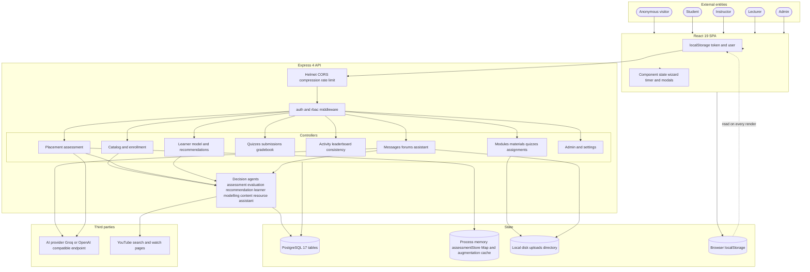

---

## 2. Where state lives

Five tiers, with different durability. The tiers below PostgreSQL are the ones that break under
the Vercel serverless deployment (`VERCEL === '1'`).

| Tier | Contents | Survives restart | Shared across instances | Notes |
| --- | --- | --- | --- | --- |
| **PostgreSQL** | All 17 tables | yes | yes | The only durable system of record |
| **Process memory** | `activeAssessments` Map (`agents/assessmentStore.js:8`), `moduleAugmentCache` Map (`agents/contentResourceAgent.js:262`) | no | no | Placement `assessmentId` is only valid within one process |
| **Local disk** | `uploads/` via multer `diskStorage` (`middleware/upload.js:17-25`) | no | no | Served by `express.static('uploads')` (`server.js:85`); ephemeral on Vercel |
| **Browser `localStorage`** | `eduflow_token`, `eduflow_user` (`api/client.js:6-13`), `eduflow_onboarding_<id>` (`component/onboarding.jsx:36`) | yes | n/a | `userStore` is a plain read, so writes do not notify React |
| **Third party** | AI completions, YouTube resolution | n/a | n/a | Best-effort; failures are swallowed |

### 2.1 Durable data, by feature

| Feature | Tables written |
| --- | --- |
| Accounts and roles | `Users` |
| Catalog and authoring | `Courses`, `Modules`, `Materials`, `Quizzes`, `Assignments` |
| Enrollment | `Enrollments` |
| Placement assessment | `AssessmentAttempts` (and `Enrollments` as a side effect) |
| In-course assessment | `QuizAttempts`, `Submissions`, `Gradebooks`, `ActivityLogs` |
| Engagement | `ActivityLogs` |
| Communication | `Messages`, `AssistantMessages`, `Forums`, `Threads`, `Replies` |

### 2.2 Data that exists only in a response

Three features produce data that is never stored, so it cannot be audited, paginated or
re-shared:

| Data | Produced by | Lifetime |
| --- | --- | --- |
| Augmented materials (`_augmented: true`, string id, `aug-audio-1`) | `augmentModuleMaterials` (`agents/contentResourceAgent.js:293-389`) | One response |
| Learning-path module statuses and `pace` | `getLearningPath` (`controllers/courseController.js:384-396`) | One response — and unreachable, see `IMPLEMENTATION.md` D-01 |
| Consistency `recent14` sparkline buckets | `summarizeActivity` (`controllers/activityController.js:55-65`) | One response |

---

## 3. Write-path inventory

Complete list of model-mutating calls in `backend/`. "Agent" marks the two writes that happen
inside a read request.

| Table | Operation | Handler | Line |
| --- | --- | --- | --- |
| `Users` | `create` | `register` | `authController.js:37` |
| `Users` | `updateLastLogin()` → `save` | `login` | `authController.js:94` |
| `Users` | `createPasswordResetToken()` → `save` | `requestPasswordReset` | `authController.js:155` |
| `Users` | `update` | `updatePassword` / `resetPassword` / settings | `authController.js:190`, `:228`; `settingsController.js:36` |
| `Users` | `create` | `createUser` (admin) | `adminController.js:76` |
| `Users` | `update` | `updateUser` (admin) | `adminController.js:115` |
| `Users` | `destroy` | `deleteUser` (admin) | `adminController.js:149` |
| `Users` | `incrementForumPosts()` | `createThread`, `createReply` | `forumController.js:127`, `:209` |
| `Courses` | `create` | `createCourse` | `courseController.js:100` |
| `Courses` | `update` | `updateCourse` | `courseController.js:137` |
| `Courses` | `destroy` | `deleteCourse` | `courseController.js:166` |
| `Modules` | `create` | `createModule` | `moduleController.js:101` |
| `Modules` | `update` | `updateModule` | `moduleController.js:137` |
| `Modules` | `destroy` (after Materials) | `deleteModule` | `moduleController.js:168-170` |
| `Materials` | `create` | `createMaterial` | `materialController.js:68` |
| `Materials` | `update` | `updateMaterial` | `materialController.js:115` |
| `Materials` | `destroy` | `deleteMaterial` | `materialController.js:145` |
| `Materials` | `update` — **agent write inside a read** | `enrichVideoItem` → `updateVideoMaterial` | `contentResourceAgent.js:225`, called from `:406` |
| `Materials` | `update` — **agent write inside a read** | `enrichAudioItem` | `contentResourceAgent.js:429` |
| `Materials` | `findOrCreate` / `update` | seed script | `scripts/generateCourseContent.js:96`, `:121` |
| `Enrollments` | `findOrCreate` | `submitAssessment` | `assessmentController.js:101` |
| `Enrollments` | *never written elsewhere* | — | — |
| `AssessmentAttempts` | `create` | `submitAssessment` | `assessmentController.js:111` |
| `Quizzes` | `create` / `update` / `destroy` (after attempts) | quiz CRUD | `quizController.js:99`, `:138`, `:168-170` |
| `QuizAttempts` | `create` | `submitQuiz` | `quizController.js:231` |
| `QuizAttempts` | `destroy` | `deleteQuiz` | `quizController.js:168` |
| `Assignments` | `create` / `update` / `destroy` (after submissions) | assignment CRUD | `assignmentController.js:86`, `:129`, `:159-161` |
| `Submissions` | `create` | `submitAssignment` | `assignmentController.js:206` |
| `Submissions` | `destroy` | `deleteAssignment` | `assignmentController.js:159` |
| `Submissions` | `update` (grade, feedback) | `gradeSubmission` | `gradebookController`/assignment controller |
| `Gradebooks` | `create` / `save` | `calculateGradebook` | `gradebookController.js:163-184` |
| `Gradebooks` | `update` | `updateGradebook` | `gradebookController.js:78` |
| `Gradebooks` | `findOrCreate` / `update` | seed script | `scripts/seedCourses.js:515`, `:521` |
| `ActivityLogs` | `create` | `logActivity` | `activityController.js:120` |
| `ActivityLogs` | `create` | `submitQuiz` | `quizController.js:243` |
| `ActivityLogs` | `create` | `submitAssignment` | `assignmentController.js:215` |
| `Messages` | `create` | `sendMessage`, `replyToMessage` | `messageController.js:171`, `:229` |
| `Messages` | `update` (isRead, readAt) | `markAsRead` | `messageController.js:267-297` |
| `Messages` | `update` (delete flags) | `deleteMessage` | `messageController.js:297` |
| `Messages` | `destroy` (both flags set) | `deleteMessage` | `messageController.js:318` |
| `AssistantMessages` | `create` ×2 per turn | `sendMessage` | `assistantController.js:34`, `:41` |
| `Forums` | `create` | `createForum` | `forumController.js:50` |
| `Threads` | `create` | `createThread` | `forumController.js:117` |
| `Threads` | `update` (viewCount, pin, lock) | `getThreadById`, moderation | `forumController.js:170-171`, `:234`, `:265` |
| `Replies` | `create` | `createReply` | `forumController.js:200` |
| `Users`, `Courses`, `Modules`, `Gradebooks` | `findOrCreate` / `update` | seed script | `scripts/seedCourses.js:435-521` |

### 3.1 Notable properties of the write paths

- **Every write path is single-table.** There is no transaction and no `sequelize.transaction()`
  anywhere. `submitAssessment` runs three writes in sequence — `Enrollment.findOrCreate`,
  `AssessmentAttempt.create`, `activeAssessments.delete` — each in its own try/catch, so a
  failure at step two still leaves the student enrolled (`assessmentController.js:96-132`).
- **Two agent writes happen during GET requests.** `enrichVideoItem`
  (`contentResourceAgent.js:406`) and `enrichAudioItem` (`:429`) update `Materials` while
  serving `GET /api/learner/recommendations`. Both swallow failures
  (`.catch(() => {})` at `:429`), so a read can mutate shared rows invisibly. This is the
  opposite of the module augmentation contract, which persists nothing.
- **`Enrollments` has exactly one writer.** `assessmentController.js:101`. Nothing sets
  `status` away from `active` and nothing writes `completedAt`.
- **`Gradebooks` is written by a read-modify-write** in `calculateGradebook`
  (`gradebookController.js:163-184`) — `findOne` then `save`/`create`.
- **`Users.forumPostCount` is a lost-update candidate** — `+= 1` then `save`
  (`models/User.js:107-110`).
- **Two updates spread the raw request body** onto the model: `courseController.js:137` and
  `moduleController.js:137`. Both are `Course` and `Module`, i.e. exactly the tables other
  rows point at via `courseId`.

---

## 4. Read-path inventory

What each read-heavy endpoint touches, and whether the aggregation happens in SQL or in
JavaScript. "JS rollup" means the handler fetches rows and reduces them in process.

| Endpoint | Handler | Tables read | Aggregation |
| --- | --- | --- | --- |
| `GET /api/courses` | `getAllCourses` | `Courses`, `Users` | SQL only |
| `GET /api/courses/:id` | `getCourseById` | `Courses`, `Users` | SQL only |
| `GET /api/courses/my-courses` | `getMyCourses` | `Enrollments`, `Courses`, `Users` | JS filter on `isActive` |
| `GET /api/courses/instructor-courses` | `getInstructorCourses` | `Courses` | SQL only |
| `GET /api/courses/:id/learning-path` | `getLearningPath` | `Courses`, `Modules`, `Quizzes`, `Assignments`, `QuizAttempts`, `Submissions`, `Gradebooks`, `ActivityLogs` | **8 tables, all JS rollup** (`courseController.js:300-338`) — endpoint unreachable |
| `GET /api/modules/course/:courseId` | `getModules` | `Modules`, `Materials`, `Courses` (conditional) | SQL, plus agent transform |
| `GET /api/modules/:id` | `getModuleById` | `Modules`, `Materials` | SQL only, no personalization |
| `GET /api/materials/module/:moduleId` | `getMaterials` | `Materials` | SQL only |
| `GET /api/quizzes/course/:courseId` | `getQuizzes` | `Quizzes` | SQL only — **includes `questions.correctAnswer`** |
| `GET /api/quizzes/my-attempts` | `getMyQuizAttempts` | `QuizAttempts`, `Quizzes` | SQL only |
| `GET /api/assignments/course/:courseId` | `getAssignments` | `Assignments`, `Courses` | SQL only |
| `GET /api/gradebook/my-grades` | `getMyGrades` | `Gradebooks`, `Courses` | SQL only |
| `GET /api/gradebook/cgpa` | `getMyCgpa` | `Gradebooks` | JS sum over all courses (`gradebookController.js:237`) |
| `GET /api/gradebook/course/:courseId` | `getCourseGradebook` | `Courses`, `Gradebooks`, `Users` | JS assembly |
| `POST /api/gradebook/course/:courseId/calculate` | `calculateGradebook` | `Assignments`, `Quizzes`, `Submissions`, `QuizAttempts`, `Gradebooks` | **JS sum over every submission** (`gradebookController.js:152-160`) |
| `GET /api/leaderboard` | `getLeaderboard` | `Users`, `ActivityLogs`, `QuizAttempts`, `Submissions`, `Gradebooks`, `Assignments`, `Quizzes` | **7 tables, all JS rollup** (`leaderboardController.js:22-107`) |
| `GET /api/reports/.../consistency` | `getCourseConsistency` | `Courses`, `Modules`, `Enrollments`, `ActivityLogs` | **loads every `ActivityLog` for the course, buckets in JS** (`activityController.js:186-192`) |
| `GET /api/reports/instructor/dashboard` | `getInstructorDashboard` | `Courses`, `Enrollments`, `Submissions`, `QuizAttempts`, `Assignments`, `Quizzes` | JS rollup |
| `GET /api/reports/admin/dashboard` | `getAdminDashboard` | `Users`, `Courses` | SQL `count()` per role (`reportController.js:268-283`) |
| `GET /api/learner/model` | `buildLearnerModel` | `Users`, `Enrollments`, `QuizAttempts`, `AssessmentAttempts`, `Submissions`, `ActivityLogs` | **6 tables in one `Promise.all`, all JS rollup** (`learnerModellingAgent.js:25-48`) |
| `GET /api/learner/recommendations` | `recommendResources` | `ActivityLogs`, `Materials` (+ nested `Module` → `Course`) | JS scoring (`contentResourceAgent.js:52-95`), then enrichment writes |
| `GET /api/learner/insights` | `buildLearnerModel` | same 6 tables as above | reuses the model |
| `POST /api/assessment/start` | `startAssessment` | `Courses`, `Modules` | SQL lookup, then agent generation |
| `POST /api/assessment/submit` | `submitAssessment` | `Courses` | agent evaluation, then 2 writes |
| `GET /api/assistant/history` | `getHistory` | `AssistantMessages` | SQL, `limit: 100` ascending |
| `GET /api/messages` | `getMessages` | `Messages`, `Users` | SQL, unpaginated |
| `GET /api/messages/users` | `getUsers` | `Users` | SQL, `Op.like` search |
| `GET /api/messages/unread-count` | `getUnreadCount` | `Messages` | SQL `count()` |
| `GET /api/forums/course/:courseId` | `getForums` | `Forums`, `Courses`, `Threads` | includes **all** threads unfiltered |
| `GET /api/forums/:forumId/threads` | `getThreads` | `Threads`, `Users` | SQL |
| `GET /api/forums/threads/:id` | `getThreadById` | `Threads`, `Users`, `Replies` | **increments `viewCount` on read** |

### 4.1 Read amplification

Four endpoints fan out across six or more tables with JavaScript-side reduction. All four are
behind a single request, so their cost multiplies:

| Endpoint | Tables per request | Rollup |
| --- | --- | --- |
| `GET /api/leaderboard` | 7 | Full scan of `ActivityLogs` for all students |
| `GET /api/courses/:id/learning-path` | 8 | 4 parallel batches (`Promise.all` at `:310`, `:318`) |
| `GET /api/learner/model` | 6 | 1 `Promise.all` of 6 queries |
| `GET /api/reports/.../consistency` | 4 | Loads **every** `ActivityLog` row for the course |

---

## 5. Flow 1 — Registration and login

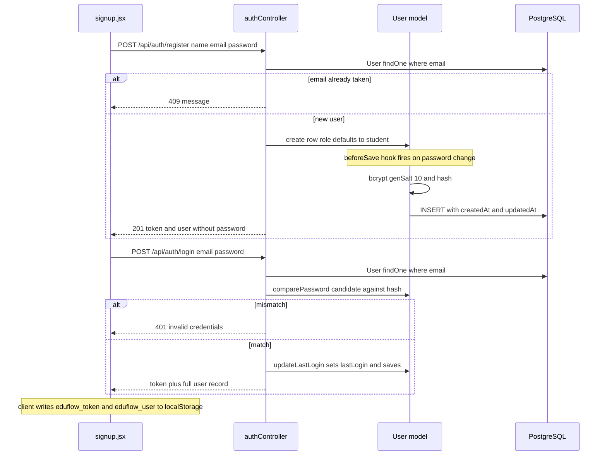

Writes: one `Users` row on register, one `Users` update on each successful login. The
`preferences` JSON is populated with its model default on insert, which is why an untouched
account has no `learningMode` key at all.

---

## 6. Flow 2 — Enrollment gate and placement assessment

The only flow where a **write is gated on a second request**. `POST /api/courses/enroll/:id`
writes nothing; the `Enrollments` row is created by a later `POST /api/assessment/submit`.

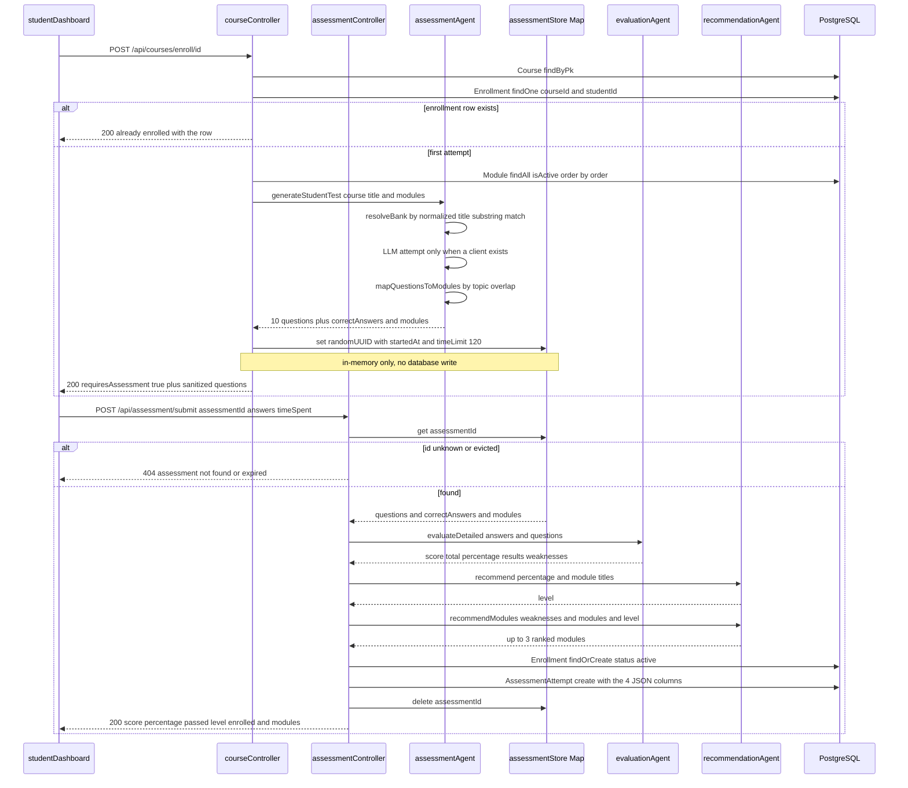

**Data-flow properties worth noting:**

- The answer key exists only in `ST` between `start` and `submit`. `sanitizeQuestions`
  (`assessmentStore.js:10-11`) strips `correctAnswer` before it reaches the client, but
  leaves `topic`, `moduleOrder` and `moduleTitle` in place — so the client learns which module
  each question belongs to before answering.
- Three independent failure boundaries wrap the database work
  (`assessmentController.js:96-132`): a `Course` miss, a `findOrCreate` throw and an
  `AssessmentAttempt.create` throw each degrade silently. The response is still `200` with
  full scores and `enrolled: false`.
- `activeAssessments.delete` runs **before** the response is sent (`:134`), so a retry of the
  same `assessmentId` returns 404. There is no expiry sweep — an abandoned assessment stays in
  the Map until the process restarts.

---

## 7. Flow 3 — Quiz attempt lifecycle

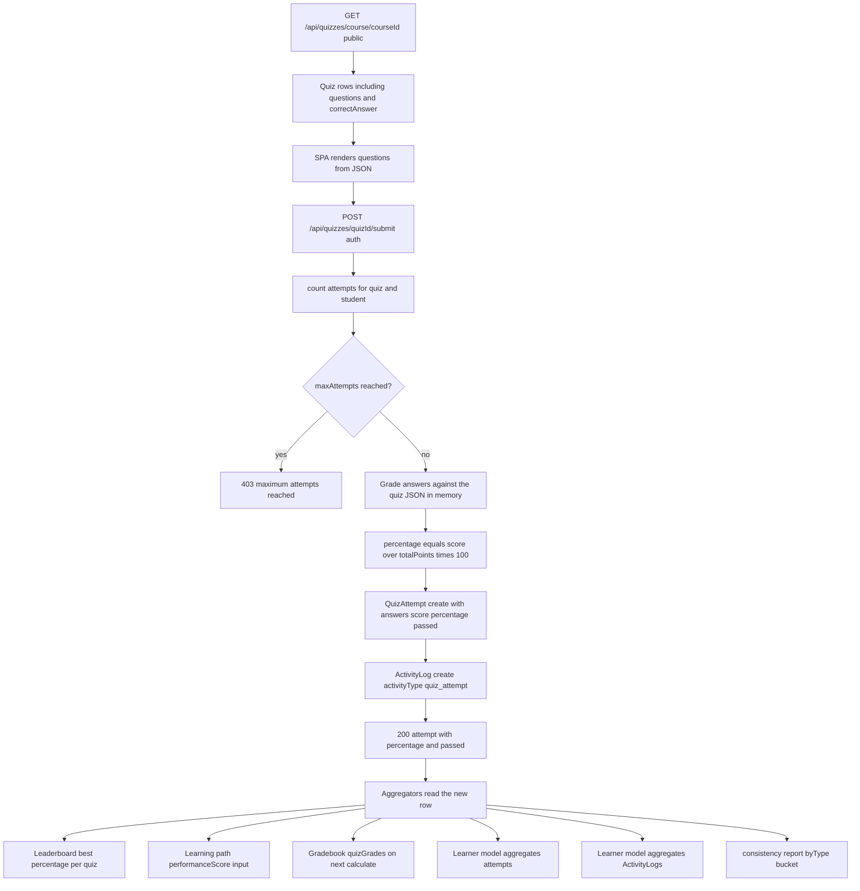

One `QuizAttempts` insert plus one `ActivityLogs` insert, then six consumers read the same
row. `quizController.js:196` enforces `maxAttempts` with a `count()` before grading, and
`:243` writes the activity log immediately after the attempt.

---

## 8. Flow 4 — Assignment submission, grading and gradebook

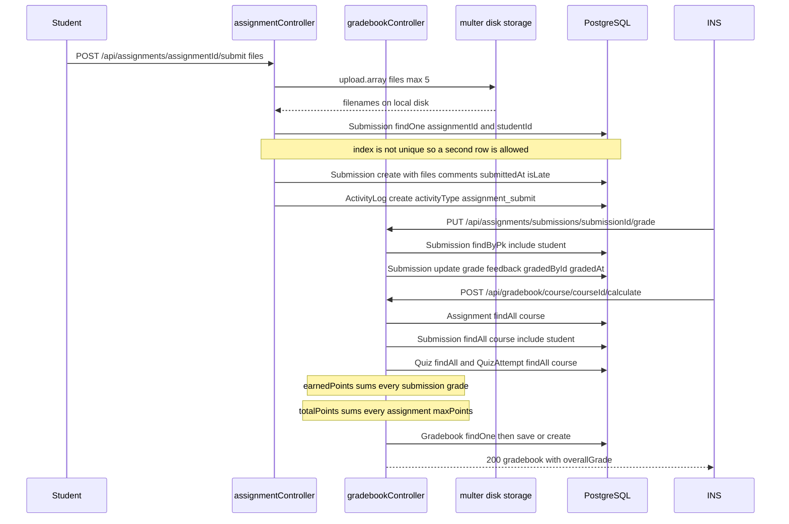

### 8.1 The gradebook formula and its two inputs

```js
// gradebookController.js:152-160
assignments.forEach(a => { totalPoints += a.maxPoints; });
submissions.forEach(s => { earnedPoints += s.grade || 0; });
const overallGrade = totalPoints > 0 ? (earnedPoints / totalPoints) * 100 : 0;
```

Two structural issues visible in the flow above:

- **`Submissions` has no unique index on `[assignmentId, studentId]`** (see
  `database-schema.md` §5), so a resubmission adds a second row. Because `earnedPoints` sums
  *all* submission rows while `totalPoints` sums each assignment once, one resubmitted and
  regraded assignment contributes its grade **twice** while its `maxPoints` is counted
  **once**.
- **Quiz grades are read but not folded in.** `QuizAttempt` is queried
  (`gradebookController.js:124`) and `quizGrades` is assembled for the JSON column, but the
  `overallGrade` arithmetic at `:152-160` only counts assignment submissions. A course with
  quizzes and no graded assignments therefore yields `overallGrade: 0` regardless of quiz
  performance.

`overallGrade` is `DECIMAL(5,2)`, so the value assigned here is rounded by Postgres to two
decimals and read back as a **string**.

---

## 9. Flow 5 — Activity telemetry and its three consumers

One table, one producer in practice, six consumers.

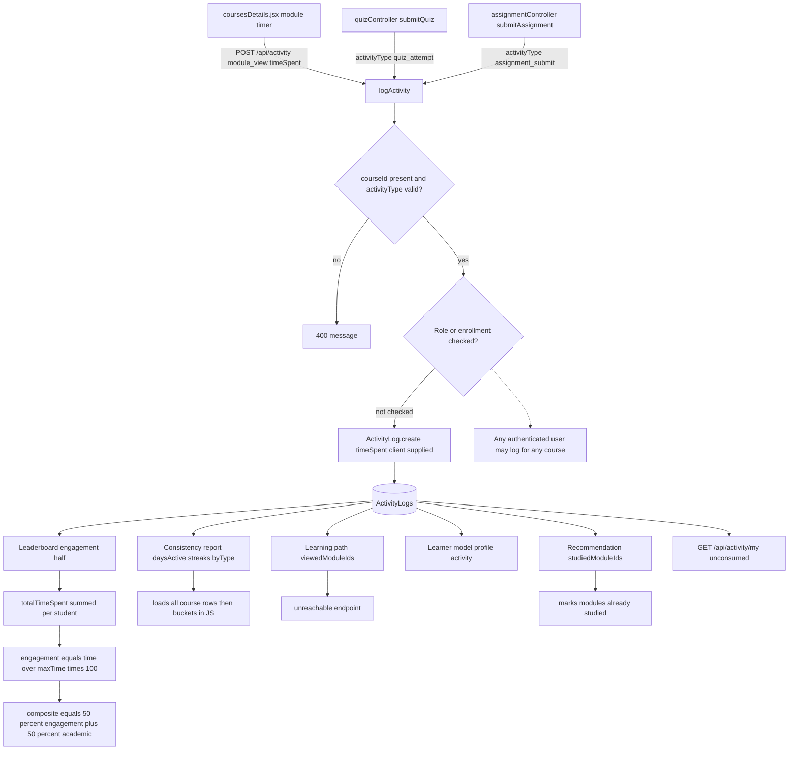

Two structural points:

- **`timeSpent` is never validated or clamped.** `logActivity` validates `courseId` and
  `activityType` (`activityController.js:99-100`) and nothing else. `timeSpent` is a bare
  client integer, and the leaderboard's engagement term is `row.totalTimeSpent / maxTime`, so
  a single large value both raises one row and raises the denominator for everyone else.
- **The consistency report has no server-side aggregation.** `activityController.js:186`
  fetches every `ActivityLog` for the course into memory and buckets by `studentId` in JS
  (`:186-192`). The `[courseId, performedAt]` index helps the scan but does no grouping.

---

## 10. Flow 6 — CMS authoring

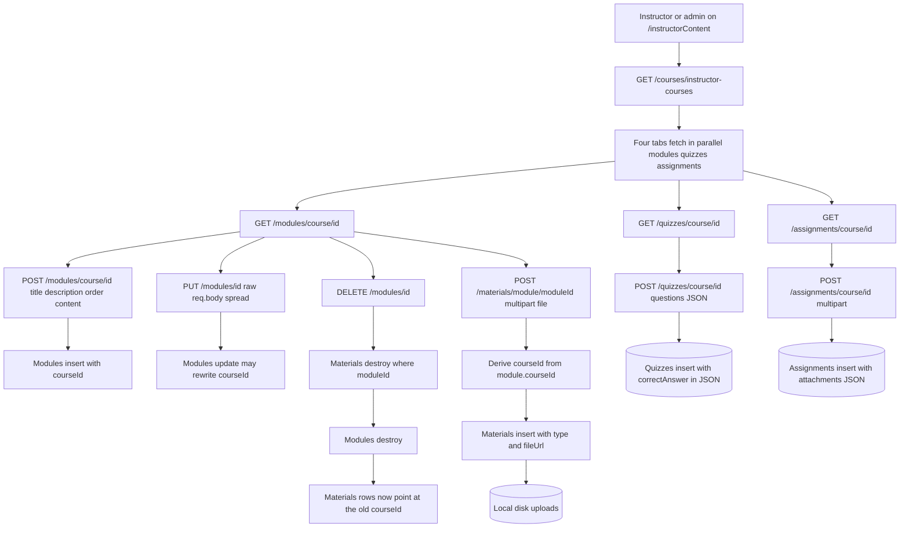

The authoring path writes `Modules`, `Materials`, `Quizzes` and `Assignments` and, for
uploads, the local disk. Three consequences visible in the diagram:

1. **Material `courseId` is derived, never validated independently.** `materialController.js:60`
   reads the module, `:76` copies `module.courseId`. If `updateModule` later rewrites a
   module's `courseId` from the raw request body (`moduleController.js:137`), every material
   pointing at that module keeps the old value and the two FKs now name different courses.
2. **Quizzes store the answer key in a public column.** `questions` JSON contains
   `correctAnswer`, and both quiz read routes are unauthenticated.
3. **Deletion is hand-ordered.** Module deletion removes materials first; quiz deletion removes
   attempts first; assignment deletion removes submissions first. Course deletion does
   neither — see §14.

---

## 11. Flow 7 — Module personalization read path

The clearest example in the codebase of a response that differs per request without any
corresponding difference in storage.

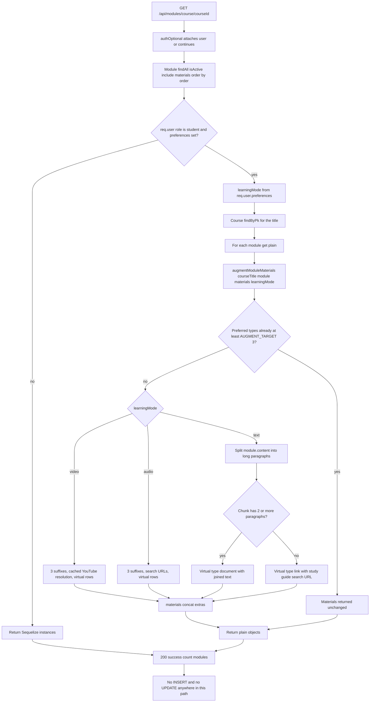

Two data-flow properties worth calling out:

- **Read amplification is per module, not per request.** `Course.findByPk` happens once
  (`moduleController.js:27`), but `augmentModuleMaterials` runs once per module and the
  `video` branch performs up to 3 network-bound YouTube lookups each. A six-module course
  with a video learner can therefore trigger 18 resolutions on a cold cache.
- **The cache is keyed `moduleId:query` in a process-level `Map`**
  (`contentResourceAgent.js:262`, `:280`). On Vercel it starts empty per instance, and it is
  never evicted.

---

## 12. Flow 8 — Recommendation scoring

The only read path that writes. Scoring inputs come from the learner model; the candidate
pool comes from `Material` joined through `Module` → `Course`.

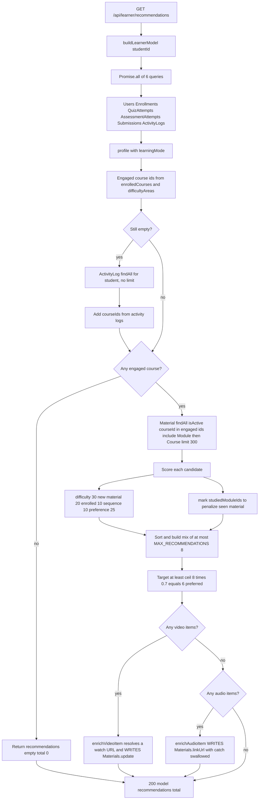

The write path in the middle of this diagram is the notable one. `enrichVideoItem`
(`contentResourceAgent.js:397-415`) resolves a real watch URL for a recommended video and then
**persists it** via `updateVideoMaterial({ id: item.moduleId }, watchUrl)` (`:406`) so later
requests reuse it. `enrichAudioItem` (`:422-435`) writes `linkUrl` for the same reason, with
`.catch(() => {})` on the write (`:429`).

So `GET /api/learner/recommendations` is not idempotent: it mutates shared `Materials` rows,
and the mutation is a side effect of who is browsing rather than of an explicit author action.

---

## 13. Flow 9 — Assistant chat

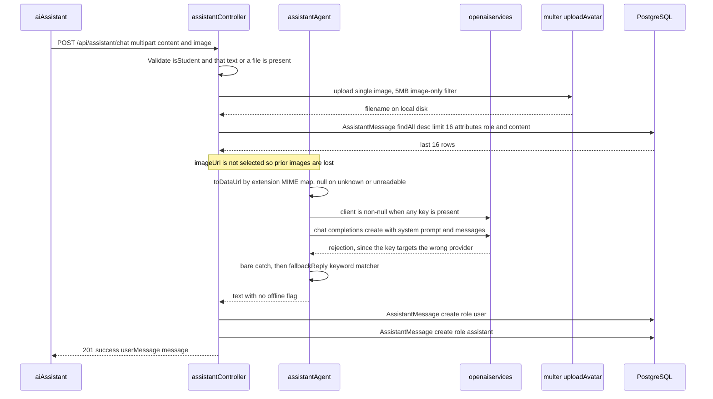

Two rows per turn, and the image path writes to disk **before** the model is consulted, so a
failed or fallback answer still leaves a file behind plus two database rows.

`GET /api/assistant/history` (`assistantController.js:59-65`) re-reads the same table with
`order: [['createdAt','ASC']]` and `limit: 100`, which returns the **oldest** 100 rows.

---

## 14. Flow 10 — Deletion semantics

No association in `models/index.js` declares `onDelete`, and no model sets `paranoid`, so
Postgres enforces `NO ACTION` / `RESTRICT` and every delete must be hand-ordered.

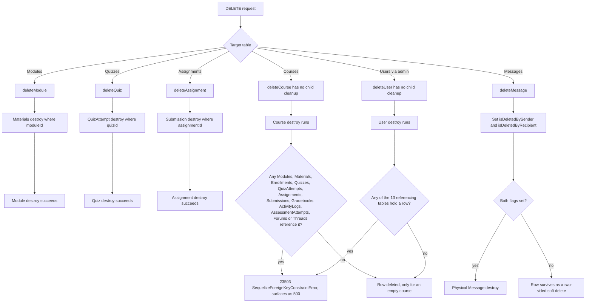

`Course` has 11 inbound foreign keys and `User` has 13, yet neither handler cleans up
(`courseController.js:153-175`, `adminController.js:149`). The `23503` failure mode is
recorded in `.agents/LESSONS.md` (2026-09-28). `Messages` is the only table with a
soft-delete mechanism, and it is two booleans rather than a `deletedAt` column.

---

## 15. Cross-cutting observations

1. **No transaction anywhere.** No `sequelize.transaction()` in the codebase. The only
   multi-write flow is `submitAssessment` (3 writes) and `calculateGradebook` (read then
   write), each with per-step try/catch that degrades silently.

2. **Two GET requests write to the database.** `enrichVideoItem` and `enrichAudioItem`
   (§12) mutate `Materials` while serving `GET /api/learner/recommendations`.
   `getThreadById` likewise increments `Threads.viewCount` on every read
   (`forumController.js:170-171`).

3. **Four aggregations happen in JavaScript over full table scans** — leaderboard (7 tables),
   learner model (6 tables), consistency report (every `ActivityLog` for a course), and the
   unreachable learning path (8 tables). `reportController.getAdminDashboard`
   (`reportController.js:268-283`) is the one that correctly delegates to SQL `count()`.

4. **The answer key is stored in two places with opposite exposure.** `Quizzes.questions`
   JSON holds `correctAnswer` and is served by two **public** routes; the placement
   assessment holds its key in process memory and strips it with `sanitizeQuestions`.

5. **`NUMERIC` columns require explicit coercion on every read.** `percentage`,
   `overallGrade` and `participationScore` arrive as strings; see `database-schema.md` §1.

6. **Resubmission is unbounded and double-counted.** `Submissions` has no unique
   `[assignmentId, studentId]` index, and `calculateGradebook` sums every row.

7. **Client-supplied numbers reach aggregation unscoped.** `timeSpent` (unvalidated) feeds the
   leaderboard; `timeSpent` on `POST /assessment/submit` is clamped only to the time limit, and
   `timeExpired` is derived from that client value.

8. **`Enrollments` is written by exactly one call site**, `assessmentController.js:101`, so the
   enrollment gate's real enforcement is that single `findOrCreate` rather than any status code
   on the enroll route.

9. **Three quarters of the read surface is unreachable from the UI.** The forum subsystem
   (§4), `GET /api/activity/my`, `GET /api/messages/unread-count`,
   `DELETE /api/messages/:id`, and `POST /assessment/evaluate` / `recommend` have no frontend
   caller, so several tables receive no data in practice.