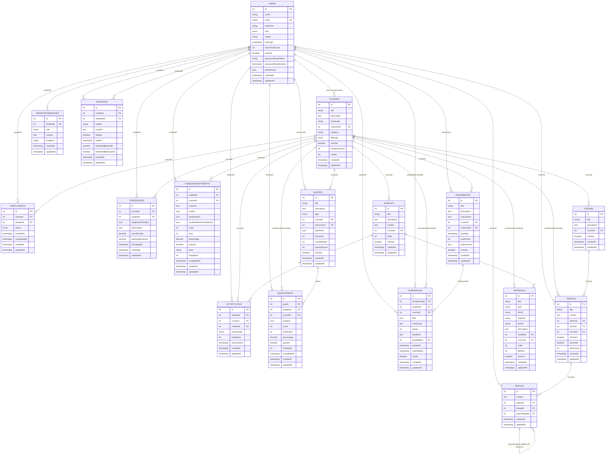
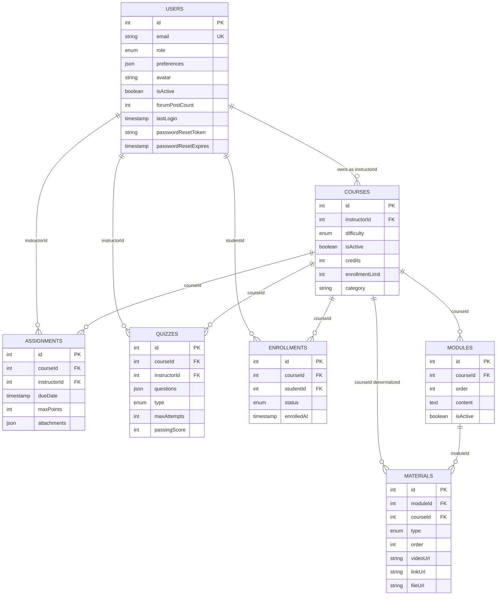
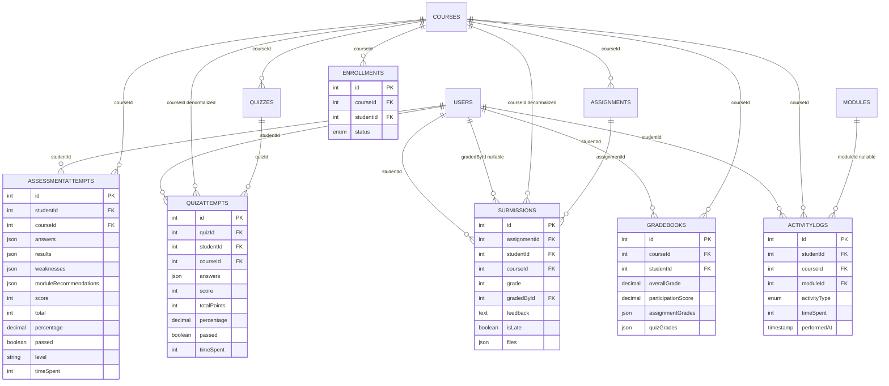
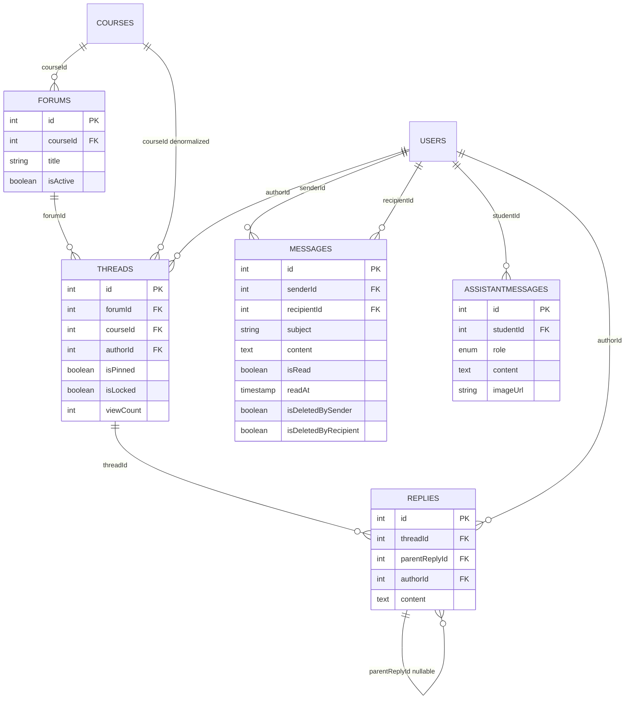

# EduFlow — Database Schema

Field-level reference for the PostgreSQL schema as it is actually declared by the Sequelize
models in `backend/models/`. Every type, nullability rule, default, index and ENUM listed
here was read from those files; `file:line` citations are given for the non-obvious ones.
Physical column names and types are **derived** from the Sequelize definitions plus
Sequelize 6 + Postgres naming rules (see §1), not read from `information_schema`, because no
query was executed against the live database.

Related: [`IMPLEMENTATION.md`](./IMPLEMENTATION.md) (behavior and defects),
[`data-flow.md`](./data-flow.md) (which handlers write and read each table),
[`uml.md`](./uml.md) (use case, sequence and deployment views).

## Contents

1. [Naming and conventions](#1-naming-and-conventions)
2. [Full entity-relationship diagram](#2-full-entity-relationship-diagram)
3. [Domain diagrams](#3-domain-diagrams)
4. [Table reference](#4-table-reference)
5. [Index inventory](#5-index-inventory)
6. [ENUM inventory](#6-enum-inventory)
7. [JSON column inventory](#7-json-column-inventory)
8. [Foreign keys, integrity and delete semantics](#8-foreign-keys-integrity-and-delete-semantics)
9. [Denormalized columns](#9-denormalized-columns)
10. [Schema management](#10-schema-management)
11. [Schema-level observations](#11-schema-level-observations)

---

## 1. Naming and conventions

Derived from how `backend/models/*.js` call `sequelize.define`, plus how the same files spell
their own `references`.

| Rule | Value | Source |
| --- | --- | --- |
| ORM | Sequelize 6, `dialect: 'postgres'` | `backend/config/database.js:3-16` |
| Table names | Model name pluralized; `underscored` is **not** set, so `Quiz` → `Quizzes`, `Reply` → `Replies`, `QuizAttempt` → `QuizAttempts`, `ActivityLog` → `ActivityLogs`, `AssistantMessage` → `AssistantMessages`, `Gradebook` → `Gradebooks` | default pluralizer; confirmed by the `references.model` strings, which are plural (`'Users'`, `'Courses'`, `'Modules'`, `'Forums'`, `'Quizzes'`, `'Assignments'`, `'Replies'`) |
| Column names | camelCase as written in the model — `underscored` is not set | default |
| Primary keys | `INTEGER PRIMARY KEY AUTO_INCREMENT` on every table, always named `id` | every model, e.g. `User.js:11-15` |
| Timestamps | `createdAt` / `updatedAt`, `timestamps: true` on all 17 models | every model |
| Soft delete | **None.** No model sets `paranoid: true`, so there is no `deletedAt` anywhere and every delete is a physical `DELETE` | verified across all models |
| Money/score types | Only `DECIMAL(5, 2)`, for the three score columns; everything else is `INTEGER`, `TEXT`, `STRING`, `BOOLEAN`, `DATE` or `JSON` | see §4 |
| FK declaration | `references: { model: '<Plural>', key: 'id' }` on the column, **plus** a `belongsTo` in `models/index.js` | see §8 for the four models where only the first exists |
| Engine defaults | `underscored`, `createdAt`/`updatedAt` names, `freezeTableName` all left at Sequelize defaults | — |

**Postgres types Sequelize emits for these `DataTypes`:** `INTEGER` → `INTEGER`, `STRING` →
`VARCHAR(255)` unless a length is given, `TEXT` → `TEXT`, `BOOLEAN` → `BOOLEAN`, `DATE` →
`TIMESTAMP WITH TIME ZONE`, `JSON` → `JSONB`, `DECIMAL(5,2)` → `NUMERIC(5,2)`, `ENUM(...)` →
a named Postgres `ENUM` type.

> ### `NUMERIC` arrives as a string
> `QuizAttempt.percentage`, `AssessmentAttempt.percentage`, `Gradebook.overallGrade` and
> `Gradebook.participationScore` are `DECIMAL(5, 2)`. The `pg` driver returns `NUMERIC` as a
> **JavaScript string**, not a number. This is why the controllers wrap them:
> `Number(attempt.percentage)` (`leaderboardController.js:58`),
> `Number(gb.overallGrade)` (`courseController.js:360`),
> `clamp(Number(g.overallGrade), 0, 100)` (`leaderboardController.js:80`),
> `Number(s.grade)` (`courseController.js:355`). Any new aggregation over these columns must
> do the same, or `"85.00" > 80` will be false.

---

## 2. Full entity-relationship diagram

All 17 tables and every declared foreign key. Cardinality notation is
`parent ||--o{ child : label` (one parent, zero-or-more children).



### 2.1 Foreign key count per table

| Table | Outgoing FKs | Notes |
| --- | --- | --- |
| `Users` | 0 | referenced 13 times |
| `Courses` | 1 (`instructorId`) | referenced 11 times — the most-referenced parent |
| `Modules` | 1 (`courseId`) | referenced 2× |
| `Materials` | 2 (`moduleId`, `courseId`) | |
| `Enrollments` | 2 | |
| `ActivityLogs` | 3 (`studentId`, `courseId`, `moduleId?`) | |
| `Gradebooks` | 2 | |
| `Quizzes` | 2 (`courseId`, `instructorId`) | |
| `QuizAttempts` | 3 (`quizId`, `studentId`, `courseId`) | |
| `Assignments` | 2 (`courseId`, `instructorId`) | |
| `Submissions` | 4 (`assignmentId`, `studentId`, `courseId`, `gradedById?`) | most outgoing FKs |
| `AssessmentAttempts` | 2 | |
| `Messages` | 2 (both `Users`) | |
| `AssistantMessages` | 1 | |
| `Forums` | 1 (`courseId`) | |
| `Threads` | 3 (`authorId`, `forumId`, `courseId`) | |
| `Replies` | 3 (`authorId`, `threadId`, `parentReplyId?`) | includes the self-reference |

---

## 3. Domain diagrams

The same 17 tables grouped by feature. Each diagram is a subset of §2, drawn separately so
a reader interested in one feature does not have to untangle all 17 tables.

### 3.1 Identity, catalog and authoring



Note that `Enrollments` is the only many-to-many junction in the schema; it carries a
`status` ENUM and a `completedAt` column, so it is a first-class entity rather than a pure
link table.

### 3.2 Assessment, grading and progress



`AssessmentAttempts` is the only table that stores an **agent's output as well as its
input** — `answers` is what the student submitted, `results` is the per-question evaluation,
and `weaknesses` plus `moduleRecommendations` are the `recommendationAgent` verdicts. Because
those are snapshots rather than derived values, a historical report stays correct even after
the scoring logic changes.

### 3.3 Engagement and communication



`Messages` and `AssistantMessages` look similar and are not: the first is user-to-user mail
with a subject line and per-side soft-delete flags; the second is a transcript whose `role`
ENUM records which side of each turn wrote it, with no subject and no delete flags.

---

## 4. Table reference

Every table, in dependency order. `PK` = primary key, `FK` = foreign key, `UK` = unique.
"Null" is the declared `allowNull`; a column absent from that column is `NOT NULL`.

### 4.1 `Users`

`backend/models/User.js`. The only table with custom instance methods and hooks.

| Column | Type | Null | Default / constraint |
| --- | --- | --- | --- |
| `id` | `INTEGER` | no | PK, auto-increment (`:11-15`) |
| `name` | `STRING` | no | `notEmpty` (`:16-22`) |
| `email` | `STRING` | no | **`unique`**, `isEmail`, `notEmpty` (`:23-32`) |
| `password` | `STRING` | no | `len ≥ 6`, `notEmpty`; bcrypt-hashed by hook (`:33-41`) |
| `role` | `ENUM` | no | `student`, default `student` (`:42-45`) |
| `avatar` | `STRING` | yes | — |
| `lastLogin` | `DATE` | yes | set by `updateLastLogin()` |
| `forumPostCount` | `INTEGER` | no | default `0` |
| `isActive` | `INTEGER`→`BOOLEAN` | no | default `true` |
| `passwordResetToken` | `STRING` | yes | stores the **SHA-256 hash**, not the emailed token |
| `passwordResetExpires` | `DATE` | yes | `now + 10 min` |
| `preferences` | `JSON` | yes | default `{ email: true, push: false, digest: true }` |

Logic worth knowing:

- `beforeSave` hashes `password` with `bcrypt.genSalt(10)` whenever the column changed
  (`:70-76`), so hashing is applied on create **and** update, and never double-hashes an
  unchanged password.
- `createPasswordResetToken()` (`:84-96`) generates 32 random bytes, returns the **hex
  plaintext** for emailing, and stores only its SHA-256 digest.
- `incrementForumPosts()` (`:107-110`) is a read-modify-write: `this.forumPostCount += 1`
  followed by `save()`. Concurrent thread/reply creation loses increments.
- `preferences` carries `learningMode` alongside the three notification booleans, but only
  when a student has set it — the model default has no `learningMode` key, which is why
  `moduleController.js:21-24` guards on `req.user.preferences` truthiness.

### 4.2 `Courses`

`backend/models/Course.js`.

| Column | Type | Null | Default / constraint |
| --- | --- | --- | --- |
| `id` | `INTEGER` | no | PK, auto-increment |
| `title` | `STRING` | no | `notEmpty` |
| `description` | `TEXT` | no | `notEmpty` |
| `thumbnail` | `STRING` | yes | — |
| `instructorId` | `INTEGER` | no | FK → `Users.id` (`:31-39`) |
| `category` | `STRING` | no | default `'General'` |
| `difficulty` | `ENUM` | no | `beginner`, `intermediate`, `advanced`; default `beginner` (`:43-47`) |
| `isActive` | `BOOLEAN` | no | default `true` |
| `enrollmentLimit` | `INTEGER` | yes | **declared but never enforced** — no handler compares against it |
| `credits` | `INTEGER` | no | default `3`, validated `1 ≤ credits ≤ 8` (`:52-59`) |

### 4.3 `Modules`

`backend/models/Module.js`.

| Column | Type | Null | Default / constraint |
| --- | --- | --- | --- |
| `id` | `INTEGER` | no | PK |
| `title` | `STRING` | no | `notEmpty` |
| `description` | `TEXT` | yes | default `''` |
| `content` | `TEXT` | yes | default `''` — the body the `text` augmentation mode splits into reading chunks |
| `courseId` | `INTEGER` | no | FK → `Courses.id` (`:27-33`) |
| `order` | `INTEGER` | no | default `0`; **not unique per course**, so ties are possible and `order: [['order','ASC']]` leaves intra-tie order undefined |
| `isActive` | `BOOLEAN` | no | default `true` |

`content` is the source for `augmentModuleMaterials`'s `text` mode: paragraphs longer than
80 characters are split and regrouped (`agents/contentResourceAgent.js:355-358`).

### 4.4 `Materials`

`backend/models/Material.js`.

| Column | Type | Null | Default / constraint |
| --- | --- | --- | --- |
| `id` | `INTEGER` | no | PK |
| `title` | `STRING` | no | `notEmpty` |
| `type` | `ENUM` | no | `document`, `image`, `video`, `audio`, `link`; **no default** (`:20-23`) |
| `fileUrl` | `STRING` | yes | uploaded path |
| `videoUrl` | `STRING` | yes | a real YouTube **watch** URL after enrichment |
| `linkUrl` | `STRING` | yes | search URL or external link |
| `description` | `TEXT` | yes | default `''` |
| `moduleId` | `INTEGER` | no | FK → `Modules.id` (`:39-45`) |
| `courseId` | `INTEGER` | no | FK → `Courses.id`; redundant with `moduleId → Module.courseId` (`:46-52`) |
| `order` | `INTEGER` | no | default `0` |
| `fileSize` | `INTEGER` | no | default `0` |
| `isActive` | `BOOLEAN` | no | default `true` |

A material is one of five kinds, and the URL column that matters depends on which:
`fileUrl` for uploads, `videoUrl` for playable video, `linkUrl` for `link`/`audio`. The
`audio` type has no audio file column at all — `enrichAudioItem` attaches a *search* URL
(`contentResourceAgent.js:427`), which is why audio can never be streamed inline.

Augmented (virtual) materials returned by `GET /api/modules/course/:courseId` are **not**
rows: they carry string ids like `"12-aug-video-1"` and a `_augmented: true` marker, and are
never inserted (§7.3 of `IMPLEMENTATION.md`).

### 4.5 `Enrollments`

`backend/models/Enrollment.js`.

| Column | Type | Null | Default / constraint |
| --- | --- | --- | --- |
| `id` | `INTEGER` | no | PK |
| `courseId` | `INTEGER` | no | FK → `Courses.id` |
| `studentId` | `INTEGER` | no | FK → `Users.id` |
| `status` | `ENUM` | no | `active`, `completed`, `dropped`; default `active` |
| `enrolledAt` | `DATE` | yes | set on `findOrCreate` |
| `completedAt` | `DATE` | yes | **never written by any handler** |

Indexes: **unique composite on `[courseId, studentId]`** plus a plain `[studentId]`. The
composite unique index is what makes the enrollment gate idempotent — it is the database,
not application code, that guarantees one row per student per course.

`completedAt` has no writer, and no handler transitions `status` away from `active`, so the
`completed` and `dropped` ENUM values are unreachable. `activityController.js:562` surfaces
`status` to the consistency report regardless.

### 4.6 `ActivityLogs`

`backend/models/ActivityLog.js`. The single source of engagement telemetry.

| Column | Type | Null | Default / constraint |
| --- | --- | --- | --- |
| `id` | `INTEGER` | no | PK |
| `studentId` | `INTEGER` | no | FK → `Users.id` |
| `courseId` | `INTEGER` | no | FK → `Courses.id` |
| `moduleId` | `INTEGER` | yes | FK → `Modules.id`; null for non-module activity |
| `activityType` | `ENUM` | no | `module_view`, `quiz_attempt`, `assignment_submit` (`:30-34`) |
| `timeSpent` | `INTEGER` | no | default `0` — **seconds**, client-supplied |
| `performedAt` | `DATE` | no | default `NOW` |

Three indexes (`:40-44`): `[studentId, courseId]`, `[courseId, performedAt]`,
`[studentId, performedAt]`. The latter two are shaped for exactly the two consumers:
the consistency report scans a course over time, and the learner's own activity page scans
one student over time.

`timeSpent` is an unvalidated client-supplied integer with no upper bound, and the only
producer writes `module_view` (`frontend/src/screens/coursesDetails.jsx:258`). Since the
leaderboard's engagement half is `totalTimeSpent / maxTime`, one inflated row moves both the
row and the denominator — see `IMPLEMENTATION.md` D-17.

### 4.7 `Gradebooks`

`backend/models/Gradebook.js`.

| Column | Type | Null | Default / constraint |
| --- | --- | --- | --- |
| `id` | `INTEGER` | no | PK |
| `courseId` | `INTEGER` | no | FK → `Courses.id` |
| `studentId` | `INTEGER` | no | FK → `Users.id` |
| `assignmentGrades` | `JSON` | yes | default `[]` |
| `quizGrades` | `JSON` | yes | default `[]` |
| `overallGrade` | `DECIMAL(5,2)` | no | default `0` |
| `participationScore` | `DECIMAL(5,2)` | no | default `0` — **never written by any handler** |
| `lastUpdated` | `DATE` | no | default `NOW` |

Indexes: **unique composite `[courseId, studentId]`** plus `[studentId]` (`:47-50`).

`calculateGradebook` (`controllers/gradebookController.js:163-184`) does a `findOne` and then
either assigns-and-saves or creates — a read-modify-write. The unique composite index turns
a concurrent double-create into a `23505` unique violation rather than a duplicate row, so
the worst case is a `500`, not bad data.

### 4.8 `Quizzes`

`backend/models/Quiz.js`.

| Column | Type | Null | Default / constraint |
| --- | --- | --- | --- |
| `id` | `INTEGER` | no | PK |
| `title` | `STRING` | no | `notEmpty` |
| `description` | `TEXT` | yes | default `''` |
| `type` | `ENUM` | no | `quiz`, `test`, `exam`; default `quiz` (`:25-29`) |
| `courseId` | `INTEGER` | no | FK → `Courses.id` |
| `instructorId` | `INTEGER` | no | FK → `Users.id` |
| `questions` | `JSON` | no | default `[]` — the MCQ bank, stored unvalidated |
| `timeLimit` | `INTEGER` | yes | nullable; no default |
| `maxAttempts` | `INTEGER` | no | default `1` |
| `passingScore` | `INTEGER` | no | default `70` |
| `isActive` | `BOOLEAN` | no | default `true` |

`questions` has no JSONB shape validation, so a quiz created through
`POST /api/quizzes/course/:courseId` can hold any structure the submit handler does not
expect. `maxAttempts` and `passingScore` are declared defaults; the quiz submit path
(`controllers/quizController.js:231`) is what decides grading, and `passingScore` is the
comparison it uses.

### 4.9 `QuizAttempts`

`backend/models/QuizAttempt.js`.

| Column | Type | Null | Default / constraint |
| --- | --- | --- | --- |
| `id` | `INTEGER` | no | PK |
| `quizId` | `INTEGER` | no | FK → `Quizzes.id` |
| `studentId` | `INTEGER` | no | FK → `Users.id` |
| `courseId` | `INTEGER` | no | FK → `Courses.id`; denormalized |
| `answers` | `JSON` | no | default `[]` |
| `score` | `INTEGER` | no | no default — required |
| `totalPoints` | `INTEGER` | no | no default — required |
| `percentage` | `DECIMAL(5,2)` | no | no default — required |
| `passed` | `BOOLEAN` | no | no default — required |
| `timeSpent` | `INTEGER` | no | default `0` |
| `completedAt` | `DATE` | no | default `NOW` |

Indexes: `[quizId, studentId]`, `[studentId]` (`:47-50`). The composite is **not** unique, so
retakes accumulate; both the leaderboard and the learning path therefore reduce with
"best percentage per quiz" in JavaScript rather than in SQL.

### 4.10 `Assignments`

`backend/models/Assignment.js`.

| Column | Type | Null | Default / constraint |
| --- | --- | --- | --- |
| `id` | `INTEGER` | no | PK |
| `title` | `STRING` | no | `notEmpty` |
| `description` | `TEXT` | no | `notEmpty` |
| `instructions` | `TEXT` | yes | default `''` |
| `courseId` | `INTEGER` | no | FK → `Courses.id` |
| `instructorId` | `INTEGER` | no | FK → `Users.id` |
| `dueDate` | `DATE` | **no** | required — `NOT NULL` with no default (`:34-37`) |
| `maxPoints` | `INTEGER` | no | default `100` |
| `attachments` | `JSON` | yes | default `[]` |
| `isActive` | `BOOLEAN` | no | default `true` |

`maxPoints` is the denominator for three separate normalizations: the learning path
(`courseController.js:355-356`), the leaderboard (`leaderboardController.js:76`) and
`calculateGradebook` (`gradebookController.js:160`).

### 4.11 `Submissions`

`backend/models/Submission.js`.

| Column | Type | Null | Default / constraint |
| --- | --- | --- | --- |
| `id` | `INTEGER` | no | PK |
| `assignmentId` | `INTEGER` | no | FK → `Assignments.id` |
| `studentId` | `INTEGER` | no | FK → `Users.id` |
| `courseId` | `INTEGER` | no | FK → `Courses.id`; denormalized |
| `files` | `JSON` | yes | default `[]` — uploaded paths |
| `comments` | `TEXT` | yes | default `''` |
| `grade` | `INTEGER` | yes | null until graded |
| `feedback` | `TEXT` | yes | default `''` |
| `gradedById` | `INTEGER` | yes | FK → `Users.id`; null until graded |
| `gradedAt` | `DATE` | yes | null until graded |
| `submittedAt` | `DATE` | no | default `NOW` |
| `isLate` | `BOOLEAN` | no | default `false` |

Indexes: `[assignmentId, studentId]`, `[studentId]` (`:56-59`) — **not** unique, so a
student may submit the same assignment more than once and a resubmission adds a second row
rather than replacing the first.

This has a concrete consequence for grading: `calculateGradebook` sums `submission.grade`
over **all** submissions and divides by the sum of **all** assignment `maxPoints`
(`gradebookController.js:152-160`). Two submissions for one assignment double that
assignment's weight, and a resubmitted-and-regraded attempt counts twice.

### 4.12 `AssessmentAttempts`

`backend/models/AssessmentAttempt.js`.

| Column | Type | Null | Default / constraint |
| --- | --- | --- | --- |
| `id` | `INTEGER` | no | PK |
| `studentId` | `INTEGER` | no | FK → `Users.id` |
| `courseId` | `INTEGER` | no | FK → `Courses.id` |
| `answers` | `JSON` | no | default `[]` |
| `results` | `JSON` | no | default `[]` — per-question evaluation output |
| `weaknesses` | `JSON` | no | default `[]` |
| `moduleRecommendations` | `JSON` | no | default `[]` — ranked agent output snapshot |
| `score` | `INTEGER` | no | required |
| `total` | `INTEGER` | no | required |
| `percentage` | `DECIMAL(5,2)` | no | required |
| `passed` | `BOOLEAN` | no | required |
| `level` | `STRING` | yes | `Advanced` / `Intermediate` / `Beginner`; a `STRING`, not an ENUM, so no database-level validation |
| `timeSpent` | `INTEGER` | no | default `0` |
| `completedAt` | `DATE` | no | default `NOW` |

Indexes: `[studentId, courseId]`, `[studentId]` (`:58-61`).

Four JSON columns hold agent output. This table is the durable record behind
`GET /api/learner/insights` and the learner's `weaknessAreas`, which read
`buildLearnerModel` aggregates rather than re-running the agents.

### 4.13 `Messages`

`backend/models/Message.js`.

| Column | Type | Null | Default / constraint |
| --- | --- | --- | --- |
| `id` | `INTEGER` | no | PK |
| `senderId` | `INTEGER` | no | FK → `Users.id` |
| `recipientId` | `INTEGER` | no | FK → `Users.id` |
| `subject` | `STRING` | no | `notEmpty` |
| `content` | `TEXT` | no | `notEmpty` |
| `isRead` | `BOOLEAN` | no | default `false` |
| `readAt` | `DATE` | yes | null until read |
| `isDeletedBySender` | `BOOLEAN` | no | default `false` |
| `isDeletedByRecipient` | `BOOLEAN` | no | default `false` |

Indexes: `[senderId, createdAt]`, `[recipientId, isRead, createdAt]` (`:57-60`). The second
index matches the unread filter plus chronological ordering used by the mailbox query.

`isDeletedBySender` / `isDeletedByRecipient` are the closest thing to soft delete in the
schema, but they are manual flags, not `paranoid`: the row survives until **both** flags are
set, at which point `DELETE /api/messages/:id` removes it
(`controllers/messageController.js:318`).

### 4.14 `AssistantMessages`

`backend/models/AssistantMessage.js`.

| Column | Type | Null | Default / constraint |
| --- | --- | --- | --- |
| `id` | `INTEGER` | no | PK |
| `studentId` | `INTEGER` | no | FK → `Users.id` (`:11-14`) |
| `role` | `ENUM` | no | `user`, `assistant` (`:15-18`) |
| `content` | `TEXT` | no | `notEmpty` |
| `imageUrl` | `STRING` | yes | `/uploads/<filename>` |

Index: `[studentId, createdAt]` (`:30-32`), matching both the ascending `limit: 100` history
query and the descending 16-row context query.

One row per side of a turn, so a conversation of *n* exchanges produces `2n` rows. An
image-only turn stores `content: 'Shared an image'`
(`controllers/assistantController.js:38`) because `content` is `notEmpty`.

### 4.15 `Forums`

`backend/models/Forum.js`. No indexes beyond the primary key.

| Column | Type | Null | Default / constraint |
| --- | --- | --- | --- |
| `id` | `INTEGER` | no | PK |
| `title` | `STRING` | no | `notEmpty` |
| `description` | `TEXT` | yes | default `''` |
| `courseId` | `INTEGER` | no | FK → `Courses.id` |
| `isActive` | `BOOLEAN` | no | default `true` |

`isActive` is honoured by `getForums` but **not** by `createThread`, so a deactivated forum
still accepts new threads.

### 4.16 `Threads`

`backend/models/Thread.js`.

| Column | Type | Null | Default / constraint |
| --- | --- | --- | --- |
| `id` | `INTEGER` | no | PK |
| `title` | `STRING` | no | `notEmpty` |
| `content` | `TEXT` | no | `notEmpty` |
| `authorId` | `INTEGER` | no | FK → `Users.id` |
| `forumId` | `INTEGER` | no | FK → `Forums.id` |
| `courseId` | `INTEGER` | no | FK → `Courses.id`; denormalized |
| `isPinned` | `BOOLEAN` | no | default `false` |
| `isLocked` | `BOOLEAN` | no | default `false` |
| `viewCount` | `INTEGER` | no | default `0` |

Indexes: `[forumId, createdAt]`, `[authorId]` (`:55-58`). There is **no** index on
`isPinned`, so pinned ordering is done in JS after an unfiltered fetch.

`viewCount` increments on every thread read (`controllers/forumController.js:170-171`), so it
counts requests, not distinct readers.

### 4.17 `Replies`

`backend/models/Reply.js`.

| Column | Type | Null | Default / constraint |
| --- | --- | --- | --- |
| `id` | `INTEGER` | no | PK |
| `content` | `TEXT` | no | `notEmpty` |
| `authorId` | `INTEGER` | no | FK → `Users.id` |
| `threadId` | `INTEGER` | no | FK → `Threads.id` |
| `parentReplyId` | `INTEGER` | yes | FK → `Replies.id`; self-reference |

Index: `[threadId, createdAt]` (`:33-35`).

The self-reference has a database-level FK but **no application-level integrity**: 
`createReply` accepts any `parentReply` id without checking that the parent belongs to the
same `threadId` (`controllers/forumController.js:204`), so a reply can claim a parent from
another thread. There is also no depth cap and no cycle detection, and nothing in the codebase
ever populates `parentReplyId` — the `belongsTo`/`hasMany` self-associations
(`models/index.js`) are declared but never used, so the nesting model is unused capacity.

---

## 5. Index inventory

| Table | Index | Unique | Serves |
| --- | --- | --- | --- |
| `Users` | `email` | **yes** (`unique: true` on the column) | login lookup, `findOne({ where: { email } })` |
| `Courses` | `[instructorId, isActive]` | no | `getInstructorCourses`, instructor dashboard |
| `Modules` | `[courseId, order]` | no | `GET /api/modules/course/:courseId` ordered by `order` |
| `Materials` | `[moduleId, order]` | no | the `include: [{ as: 'materials' }]` in every module read |
| `Enrollments` | `[courseId, studentId]` | **yes** | makes enrollment idempotent; the gate's `findOne` |
| `Enrollments` | `[studentId]` | no | `getMyCourses` |
| `ActivityLogs` | `[studentId, courseId]` | no | per-student-per-course rollups |
| `ActivityLogs` | `[courseId, performedAt]` | no | `getCourseConsistency`, which scans a course's whole history |
| `ActivityLogs` | `[studentId, performedAt]` | no | `GET /api/activity/my` |
| `Gradebooks` | `[courseId, studentId]` | **yes** | one gradebook per student per course |
| `Gradebooks` | `[studentId]` | no | `getMyGrades` |
| `Quizzes` | `[courseId, isActive]` | no | `GET /api/quizzes/course/:courseId` |
| `QuizAttempts` | `[quizId, studentId]` | no | best-per-quiz reduction |
| `QuizAttempts` | `[studentId]` | no | `getMyQuizAttempts` |
| `Assignments` | `[courseId, dueDate]` | no | course assignment list ordered by deadline |
| `Submissions` | `[assignmentId, studentId]` | no | instructor grading queue (not unique → resubmissions) |
| `Submissions` | `[studentId]` | no | `getMySubmissions` |
| `AssessmentAttempts` | `[studentId, courseId]` | no | learner-model rollups |
| `AssessmentAttempts` | `[studentId]` | no | learner-model rollups |
| `Messages` | `[senderId, createdAt]` | no | sent folder |
| `Messages` | `[recipientId, isRead, createdAt]` | no | inbox + unread filter |
| `AssistantMessages` | `[studentId, createdAt]` | no | history read and context replay |
| `Threads` | `[forumId, createdAt]` | no | thread list |
| `Threads` | `[authorId]` | no | author profile |
| `Replies` | `[threadId, createdAt]` | no | reply list |
| `Forums` | *none beyond PK* | — | `getForums` filters on `courseId` with no supporting index |

Only **three** composite indexes are unique, and every one of them is a de-duplication
guarantee rather than a query accelerator. There is no index on any `isActive` column
outside the two composite ones that happen to include it, and none on `Material.type`, which
is what the personalization agent filters on.

---

## 6. ENUM inventory

Seven ENUM columns, which in Postgres are named types created by `sequelize.sync()`.

| Table | Column | Values | Default |
| --- | --- | --- | --- |
| `Users` | `role` | `student`, `instructor`, `lecturer`, `admin` | `student` |
| `Courses` | `difficulty` | `beginner`, `intermediate`, `advanced` | `beginner` |
| `Materials` | `type` | `document`, `image`, `video`, `audio`, `link` | none (`NOT NULL`, no default) |
| `Enrollments` | `status` | `active`, `completed`, `dropped` | `active` |
| `ActivityLogs` | `activityType` | `module_view`, `quiz_attempt`, `assignment_submit` | none |
| `Quizzes` | `type` | `quiz`, `test`, `exam` | `quiz` |
| `AssistantMessages` | `role` | `user`, `assistant` | none |

Operational notes:

- **`Materials.type` gained a value after the fact.** `audio` was added later, requiring
  `ALTER TYPE "enum_Materials_type" ADD VALUE IF NOT EXISTS 'audio'` on Postgres — recorded
  in `.agents/LESSONS.md` (2026-09-28). Adding a sixth type has the same cost.
- **Two values are unreachable.** `Enrollments.status` `completed` and `dropped` have no
  writer anywhere in the codebase.
- **`Quizzes.type` is `quiz | test | exam`,** not `mcq`. Seeding `type: 'mcq'` fails validation
  — recorded in `.agents/LESSONS.md` (2026-09-22).
- **`ActivityLogs.activityType` is validated but only one value has a UI producer.**
  `logActivity` rejects anything outside the three ENUM values
  (`controllers/activityController.js:99`), and `quizController.js:246` /
  `assignmentController.js:218` do write `quiz_attempt` and `assignment_submit`. No frontend
  screen sends either — `coursesDetails.jsx:258` is the only producer and it always sends
  `module_view`.

---

## 7. JSON column inventory

Seven JSON columns, all mapped to Postgres `JSONB`, all `defaultValue` an array or object,
and **none** validated by a JSON schema.

| Column | Declared default | What actually lives in it | Reader |
| --- | --- | --- | --- |
| `Users.preferences` | `{ email: true, push: false, digest: true }` | The three notification booleans plus `learningMode` (`text`\|`audio`\|`video`) once a student sets one | `moduleController.js:21-24`, `learnerModellingAgent`, `setLearningMode` |
| `Gradebooks.assignmentGrades` | `[]` | Per-assignment grade map from `calculateGradebook` | `getCourseGradebook` |
| `Gradebooks.quizGrades` | `[]` | Per-quiz grade map from `calculateGradebook` | `getCourseGradebook` |
| `Quizzes.questions` | `[]` | The MCQ bank: array of `{ question, options[], correctAnswer }`, stored unvalidated | `submitQuiz` |
| `QuizAttempts.answers` | `[]` | The student's selected options | `getMyQuizAttempts` |
| `AssessmentAttempts.answers` | `[]` | The student's selected options | learner agent |
| `AssessmentAttempts.results` | `[]` | `evaluationAgent.evaluateDetailed` per-question output: correct flag, correct answer, explanation | result screen |
| `AssessmentAttempts.weaknesses` | `[]` | Missed questions with `topic` and `moduleOrder` | `recommendationAgent` |
| `AssessmentAttempts.moduleRecommendations` | `[]` | Up to 3 ranked `{ moduleOrder, moduleTitle, missed, topics }` | insights + result screen |
| `Submissions.files` | `[]` | Uploaded file paths (max 5 per submit) | grading screen |
| `Assignments.attachments` | `[]` | Uploaded attachment paths (max 5 per create/update) | assignment view |

(`Submissions.files` and `Assignments.attachments` bring the JSON columns to 11 in total
across 7 models.)

Because `Quizzes.questions` stores `correctAnswer` in the same JSON the read path returns,
`GET /api/quizzes/:id` and `GET /api/quizzes/course/:courseId` are **public** routes
(`routes/quizzes.js`) — so the answer key is readable by anyone. The placement assessment
goes to lengths to keep its key server-side (`sanitizeQuestions`), while the quiz feature
publishes its own.

---

## 8. Foreign keys, integrity and delete semantics

### 8.1 Column-level FK vs Sequelize association

Every FK column declares `references: { model, key }`, which makes `sequelize.sync()` emit a
Postgres `FOREIGN KEY` constraint. Separately, `models/index.js` declares `belongsTo` /
`hasMany` pairs that control what Sequelize can `include`.

**Four models have the column and the database constraint but no Sequelize association:**

| Model | Column | Why it matters |
| --- | --- | --- |
| `Material` | `courseId` → `Courses` | `Material` only declares `belongsTo(Module)`. `include: { model: Course }` throws *"model not associated"*; the course must be reached by nesting `Module → Course`. Recorded in `.agents/LESSONS.md` (2026-09-22, Gotcha 1). |
| `Thread` | `courseId` → `Courses` | `Thread` declares `belongsTo(Forum)` and `belongsTo(User, as author)` only |
| `Submission` | `courseId` → `Courses` | `Submission` declares `belongsTo(Assignment)`, `belongsTo(User, as student)`, `belongsTo(User, as gradedBy)` only |
| `QuizAttempt` | `courseId` → `Courses` | `QuizAttempt` declares `belongsTo(Quiz)` and `belongsTo(User, as student)` only |

Conversely, **three associations are one-sided** — a `belongsTo` with no `hasMany` inverse,
so the reverse traversal does not exist:

| Association | Line | Missing inverse |
| --- | --- | --- |
| `Assignment.belongsTo(User, { as: 'instructor' })` | `models/index.js:112` | `User.hasMany(Assignment)` |
| `Quiz.belongsTo(User, { as: 'instructor' })` | `models/index.js:126` | `User.hasMany(Quiz)` |
| `Submission.belongsTo(User, { as: 'gradedBy' })` | `models/index.js:115` | `User.hasMany(Submission, { as: 'graded' })` |

### 8.2 No cascade is declared, and deletes are RESTRICT

No association in `models/index.js` sets `onDelete` or `onUpdate`, and no model sets
`cascade`. The resulting Postgres behavior is **NO ACTION / RESTRICT**: deleting a parent row
that still has children raises `SQLSTATE 23503`
(`SequelizeForeignKeyConstraintError`) — this exact failure is recorded in
`.agents/LESSONS.md` (2026-09-28, Gotcha 3).

Three handlers therefore delete children explicitly before the parent:

| Handler | Child cleanup | Line |
| --- | --- | --- |
| `deleteModule` | `Material.destroy({ where: { moduleId } })` | `moduleController.js:168` |
| `deleteAssignment` | `Submission.destroy({ where: { assignmentId } })` | `assignmentController.js:159` |
| `deleteQuiz` | `QuizAttempt.destroy({ where: { quizId } })` | `quizController.js:168` |

`deleteCourse` (`courseController.js:153-175`) does **not**. `Course` is the most-referenced
parent in the schema — 11 inbound FKs — so `DELETE /api/courses/:id` raises `23503` for any
course that still has Modules, Materials, Enrollments, Quizzes, QuizAttempts, Assignments,
Submissions, Gradebooks, ActivityLogs, AssessmentAttempts, Forums or Threads, and only
succeeds for a completely empty course. `deleteUser` (`adminController.js:149`) has the same
gap: `User` is referenced 13 times.

There is no compensating `onDelete` anywhere, no soft-delete column on any of the 17 tables,
and no cascading configuration, so a delete is only ever safe when the caller has already
removed the children by hand.

### 8.3 Application-level integrity not enforced by the schema

| Gap | Where |
| --- | --- |
| `Reply.parentReplyId` may point at a parent in another thread | `controllers/forumController.js:204` |
| `User.forumPostCount` is read-modify-write | `User.js:107-110` |
| `Module.order` is not unique per course, so ties are possible | `Module.js:38-40` |
| `Enrollment.status` / `completedAt` never transition | no writer exists |
| `Course.enrollmentLimit` is declared but never checked | no reader exists |
| `Material.courseId` can disagree with `moduleId → Module.courseId` | both are `NOT NULL` with independent FKs |
| `Submission` allows unlimited rows per assignment+student | index is not unique |

---

## 9. Denormalized columns

`courseId` is stored directly on **seven** tables, four of which reach the course only
through a parent (`Module.courseId`, `Assignment.courseId`, `Quiz.courseId`). The four
*fully* redundant copies are those whose parent already carries the course:

| Table | Redundant column | Parent chain | Used for |
| --- | --- | --- | --- |
| `Materials` | `courseId` | `moduleId` → `Modules.courseId` | flat course-scoped queries |
| `Threads` | `courseId` | `forumId` → `Forums.courseId` | forum listings by course |
| `Submissions` | `courseId` | `assignmentId` → `Assignments.courseId` | grading and progress rollups |
| `QuizAttempts` | `courseId` | `quizId` → `Quizzes.courseId` | leaderboard and learning path |

This buys single-hop queries — `where: { courseId }` without joining — at the cost of two
independent FKs per row. Nothing keeps them consistent: a row can satisfy both FKs and still
name different courses, and no handler verifies the agreement. `materialController` fills
`courseId` from the module lookup on create (`materialController.js:68`) but
`moduleController.updateModule` can rewrite a module's `courseId` from the raw request body
(`moduleController.js:137`), which would immediately desynchronize every material pointing at
that module.

---

## 10. Schema management

There is **no migration framework and no migration files**. The schema is whatever
`sequelize.sync()` declares, run on every boot:

```js
// backend/config/database.js:32
await sequelize.sync();
```

No options. That is `CREATE TABLE IF NOT EXISTS` semantics — it creates missing tables and
**never** alters or drops an existing one, so a column added to a model will not appear in a
live database. This is deliberate: `.agents/LESSONS.md` records that
`sync({ alter: true })` crashed boot-to-boot on SQLite (2026-08-16), rebuilt tables
repeatedly, and is unusable on Postgres once FK references exist (2026-08-08). Plain
create-only sync is the safe form, and it runs in production too — the 2026-09-03 lesson
records that gating sync behind a dev-only flag broke Vercel deploys.

The practical consequences:

- **Adding a column requires manual DDL.** There is no `ensureColumn` helper in the current
  `config/database.js`; the 2026-08-16 lesson describes one from an earlier SQLite-era
  version that is no longer in the file. Adding a column now means running `ALTER TABLE`
  against the live database by hand.
- **Adding an ENUM value requires `ALTER TYPE ... ADD VALUE`,** which cannot run inside a
  transaction block on Postgres.
- **No rollback path.** `sync()` cannot remove a column or a table, so a reverted model
  definition leaves the database ahead of the code.
- **Pool sizing is deployment-coupled:** `pool.max = VERCEL === '1' ? 1 : 5`
  (`config/database.js:19`), with `acquire: 10000`, `idle: 10000`.

---

## 11. Schema-level observations

Ordered by how much they affect behavior. Cross-references point at the full defect register
in `IMPLEMENTATION.md` §13.

1. **`DELETE /api/courses/:id` and `DELETE /api/admin/users/:id` will fail with `23503`**
   for any entity that has children, because `Course` and `User` are the two most-referenced
   parents and neither handler cleans up. §8.2.

2. **The quiz answer key is world-readable.** `correctAnswer` is stored inside
   `Quizzes.questions` JSON, and both quiz read routes are unauthenticated. §7.

3. **Resubmission double-counts in the gradebook.** `Submissions` has no unique constraint on
   `[assignmentId, studentId]`, and `calculateGradebook` sums every submission's grade over
   the sum of every assignment's `maxPoints`, so one resubmitted assignment gains double
   weight. §4.11.

4. **`ENUM` extension is a manual Postgres operation.** `Materials.type` already needed one
   `ALTER TYPE`; a sixth material type costs the same. §6.

5. **Declared-but-unused columns create false confidence.** `Course.enrollmentLimit`,
   `Gradebook.participationScore`, `Enrollment.completedAt` and `Enrollment.status`
   (`completed`/`dropped`) all read as live features and have no reader or writer
   respectively. §4.2, §4.5, §4.7.

6. **`NUMERIC` columns are strings in JavaScript.** Any new arithmetic over
   `percentage`, `overallGrade` or `participationScore` must coerce with `Number(...)`.
   See the callout in §1.

7. **Four tables have a `courseId` the ORM cannot traverse.** `include: { model: Course }` on
   `Material`, `Thread`, `Submission` or `QuizAttempt` throws; the association must be nested.
   §8.1.

8. **`Forum` has no index on `courseId`,** yet `getForums` filters on it and eagerly includes
   all threads unfiltered and un-deduplicated. §5.

9. **`Module.order` has no uniqueness constraint,** so two modules can share an order and
   `order: [['order','ASC']]` returns them in an undefined relative order — which the learning
   path and the "next recommended module" pick both depend on. §4.3.

10. **No table has a soft-delete column,** so every delete is irreversible except
    `Messages`, which simulates it with two boolean flags. §1, §4.13.