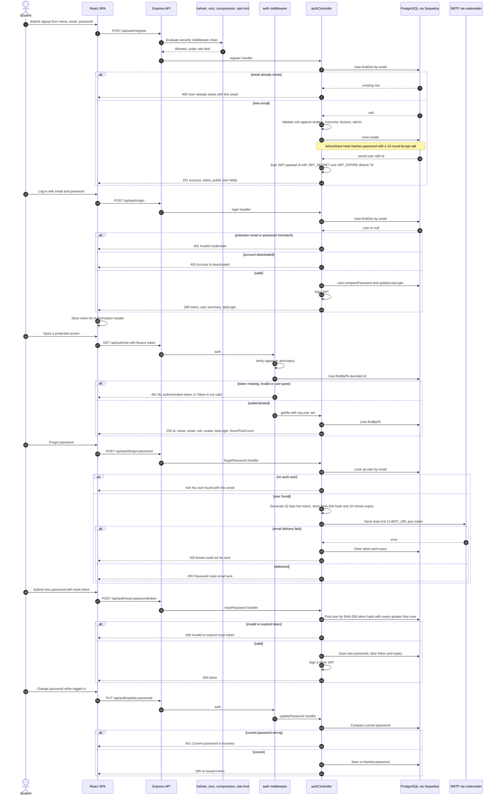
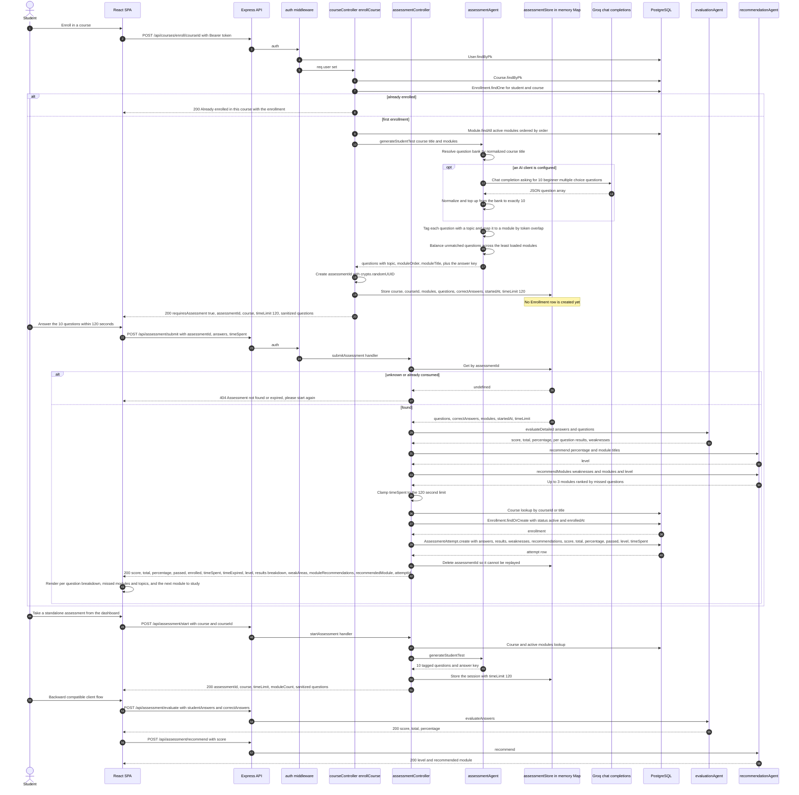
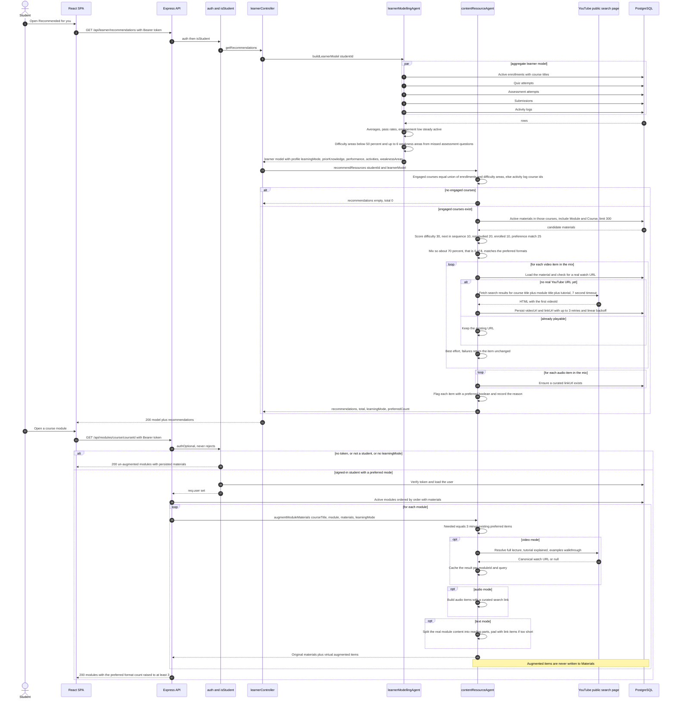
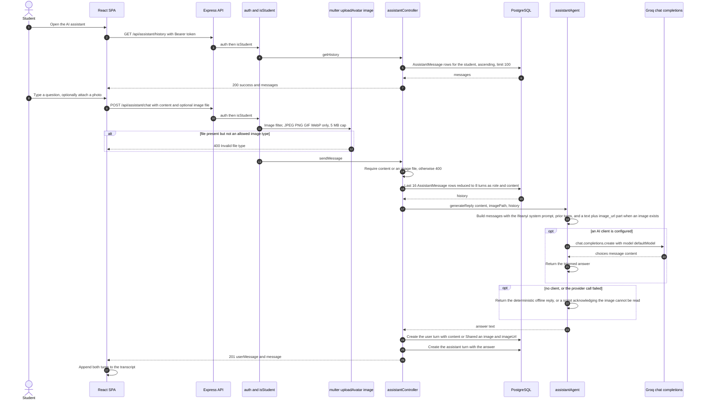
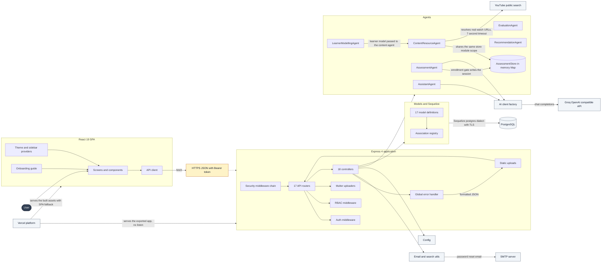
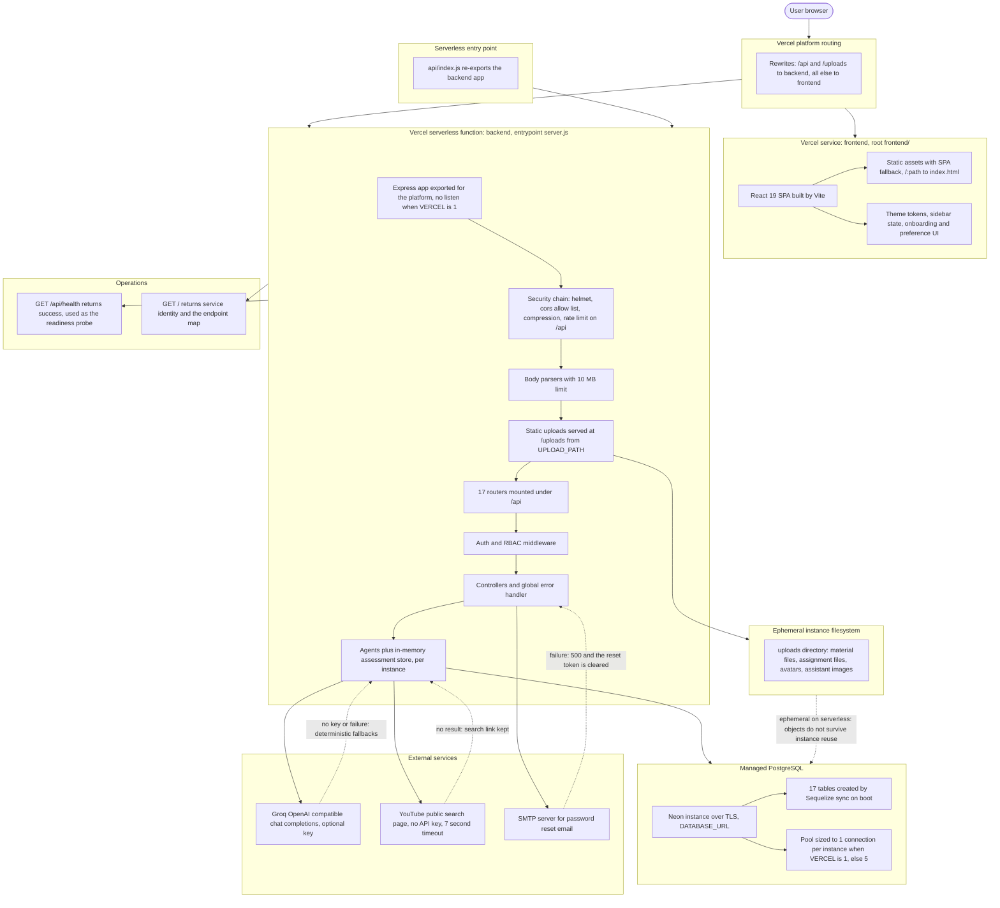

# EduFlow — UML Diagrams

All diagrams use Mermaid and describe the **as-built** system: a React 19 SPA against an Express 4 + Sequelize 6 REST API with PostgreSQL persistence, six decision agents plus a shared in-memory assessment store, and a Vercel serverless deployment against a hosted Postgres database.

| # | Diagram | Type |
| --- | --- | --- |
| 1 | Use Case | `flowchart LR` |
| 2 | Class / ER (consolidated) | `classDiagram` |
| 3 | Sequence — Authentication | `sequenceDiagram` |
| 4 | Sequence — Enrollment + Gated Assessment | `sequenceDiagram` |
| 5 | Sequence — Recommendations & Personalization | `sequenceDiagram` |
| 6 | Sequence — Chat (Assistant Ifeanyi) | `sequenceDiagram` |
| 7 | Component | `flowchart LR` |
| 8 | Activity — Student Placement + Learning Flow | `flowchart TD` |
| 9 | Deployment | `flowchart TB` |

All nine diagrams use only the renderers that are stable across Mermaid 10, 11 and 12. Sections 1 and 7 are use case and component views expressed with `flowchart` because Mermaid removed the `usecaseDiagram` and `componentDiagram` keywords in 10.9; use case ovals are `(("..."))`, actors are `(["..."])`, and component groupings are subgraphs.

**Actors used throughout:** `Student`, `Instructor`, `Lecturer`, `Admin`, plus `Anonymous` (unauthenticated visitor). Note the RBAC asymmetry that appears throughout: `isInstructorOrAdmin` admits `instructor`, `lecturer` and `admin`, while `isInstructor` admits only `instructor`; `isStudent`-guarded features (learner model, recommendations, insights, preferences, Ifeanyi) are unavailable to every staff role.

---

## 1. Use Case Diagram

```mermaid
flowchart LR
  ANON(["Anonymous"]):::actor
  STU(["Student"]):::actor
  INS(["Instructor"]):::actor
  LEC(["Lecturer"]):::actor
  ADM(["Admin"]):::actor

  subgraph SYS["EduFlow system boundary"]
    direction TB
    subgraph AUTH["Authentication and account"]
      UC01(("Register")):::uc
      UC02(("Log in")):::uc
      UC03(("Fetch current profile")):::uc
      UC04(("Request password reset email")):::uc
      UC05(("Reset password with token")):::uc
      UC06(("Change own password")):::uc
      UC07(("Update profile settings")):::uc
      UC08(("Upload profile photo")):::uc
    end

    subgraph CAT["Catalog, modules and materials"]
      UC10(("Browse and search active courses")):::uc
      UC11(("View course detail")):::uc
      UC12(("Create, update and delete own courses")):::uc
      UC13(("List own courses")):::uc
      UC14(("Read ordered modules and materials")):::uc
      UC15(("Author modules and materials")):::uc
      UC16(("Upload a material file")):::uc
    end

    subgraph PLAC["Placement assessment and enrollment"]
      UC20(("Start enrollment")):::uc
      UC21(("Take 10 question timed placement assessment")):::uc
      UC22(("Submit assessment and see detailed results")):::uc
      UC23(("Complete gated enrollment")):::uc
      UC24(("Evaluate answers statelessly")):::uc
      UC25(("Get level and module recommendation")):::uc
      UC26(("View personalized learning path")):::uc
    end

    subgraph PERS["Learner modelling and personalization"]
      UC30(("View learner model")):::uc
      UC31(("View assessment insights and weak areas")):::uc
      UC32(("Set preferred learning mode")):::uc
      UC33(("Get preference weighted content feed")):::uc
      UC34(("View augmented module materials")):::uc
    end

    subgraph CHAT["AI study assistant"]
      UC40(("Ask Ifeanyi a question")):::uc
      UC41(("Send a photo or screenshot")):::uc
      UC42(("Read assistant transcript")):::uc
    end

    subgraph ASSG["Assessment, submission and grading"]
      UC50(("Author quizzes, tests and exams")):::uc
      UC51(("Take a quiz with auto grading")):::uc
      UC52(("Review own quiz attempts")):::uc
      UC53(("Review all attempts for a quiz")):::uc
      UC54(("Author assignments with attachments")):::uc
      UC55(("Submit assignment files")):::uc
      UC56(("Review own submissions")):::uc
      UC57(("Grade a submission with feedback")):::uc
      UC58(("View gradebook")):::uc
      UC59(("Recalculate gradebook")):::uc
      UC60(("View own grades and CGPA")):::uc
    end

    subgraph COLL["Collaboration"]
      UC70(("Read forums, threads and replies")):::uc
      UC71(("Create forums")):::uc
      UC72(("Start a thread")):::uc
      UC73(("Reply and nest replies")):::uc
      UC74(("Pin and lock a thread")):::uc
      UC75(("Send, reply, read and delete messages")):::uc
      UC76(("Check unread message count")):::uc
    end

    subgraph ENGA["Engagement, reporting and administration"]
      UC80(("Log learning activity")):::uc
      UC81(("View own consistency summary")):::uc
      UC82(("View top 5 leaderboard")):::uc
      UC83(("Read course enrollment report")):::uc
      UC84(("Read course progress report")):::uc
      UC85(("Read course participation report")):::uc
      UC86(("Read course consistency report")):::uc
      UC87(("Read instructor dashboard")):::uc
      UC88(("Read admin dashboard")):::uc
      UC89(("Manage users and activation")):::uc
      UC90(("Assign instructor and toggle course status")):::uc
    end

    subgraph ONB["Onboarding"]
      UC95(("Follow 4 step first login guide")):::uc
    end
  end

  ANON --> UC01
  ANON --> UC02
  ANON --> UC04
  ANON --> UC05
  ANON --> UC10
  ANON --> UC11
  ANON --> UC14
  ANON --> UC70

  STU --> UC02
  STU --> UC03
  STU --> UC06
  STU --> UC07
  STU --> UC08
  STU --> UC13
  STU --> UC20
  STU --> UC21
  STU --> UC22
  STU --> UC23
  STU --> UC26
  STU --> UC30
  STU --> UC31
  STU --> UC32
  STU --> UC33
  STU --> UC34
  STU --> UC40
  STU --> UC41
  STU --> UC42
  STU --> UC51
  STU --> UC52
  STU --> UC55
  STU --> UC56
  STU --> UC58
  STU --> UC60
  STU --> UC72
  STU --> UC73
  STU --> UC75
  STU --> UC76
  STU --> UC80
  STU --> UC81
  STU --> UC82
  STU --> UC95

  INS --> UC12
  INS --> UC15
  INS --> UC16
  INS --> UC50
  INS --> UC53
  INS --> UC54
  INS --> UC57
  INS --> UC59
  INS --> UC71
  INS --> UC74
  INS --> UC83
  INS --> UC84
  INS --> UC85
  INS --> UC86
  INS --> UC87

  LEC --> UC12
  LEC --> UC15
  LEC --> UC16
  LEC --> UC50
  LEC --> UC54
  LEC --> UC57
  LEC --> UC59
  LEC --> UC71
  LEC --> UC74
  LEC --> UC83
  LEC --> UC84
  LEC --> UC86
  LEC --> UC87

  ADM --> UC12
  ADM --> UC15
  ADM --> UC50
  ADM --> UC54
  ADM --> UC57
  ADM --> UC59
  ADM --> UC71
  ADM --> UC74
  ADM --> UC83
  ADM --> UC84
  ADM --> UC87
  ADM --> UC88
  ADM --> UC89
  ADM --> UC90

  UC20 -.->|starts the gate| UC21
  UC21 -.->|answers submitted| UC22
  UC22 -.->|enrollment written on submit| UC23
  UC22 -.->|attempt recorded as weak areas| UC31
  UC32 -.->|preference drives the feed mix| UC33
  UC32 -.->|preference drives module augmentation| UC34
  UC31 -.->|difficulty areas raise scores| UC33
  UC50 -.->|quiz is authored content| UC51
  UC86 -.->|same consistency summarizer| UC81

  classDef actor fill:#334155,stroke:#0f172a,color:#ffffff
  classDef uc fill:#eff6ff,stroke:#1d4ed8,color:#0f172a
```

**Note on `UC56` (Review own submissions).** The handler exists, but the endpoint `GET /api/assignments/my-submissions` is declared after `GET /api/assignments/:id` in `backend/routes/assignments.js`, so the literal path is shadowed by the parameter route and the use case is currently unreachable (404). See Section 2 notes and the SRS FR-076.

---

## 2. Class / ER Diagram (consolidated)

```mermaid
classDiagram
  class User {
    +int id PK
    +string name
    +string email UK
    +string password
    +enum role student, instructor, lecturer, admin
    +string avatar
    +datetime lastLogin
    +int forumPostCount
    +boolean isActive
    +string passwordResetToken
    +datetime passwordResetExpires
    +JSON preferences
    +comparePassword() bool
    +createPasswordResetToken() string
    +updateLastLogin() promise
    +incrementForumPosts() promise
  }

  class Course {
    +int id PK
    +string title
    +string description
    +string thumbnail
    +string category
    +enum difficulty beginner, intermediate, advanced
    +boolean isActive
    +int enrollmentLimit
    +int credits
    +int instructorId FK
  }

  class Module {
    +int id PK
    +string title
    +string description
    +text content
    +int order
    +boolean isActive
    +int courseId FK
  }

  class Material {
    +int id PK
    +string title
    +enum type document, image, video, audio, link
    +string fileUrl
    +string videoUrl
    +string linkUrl
    +string description
    +int order
    +int fileSize
    +boolean isActive
    +int moduleId FK
    +int courseId FK
  }

  class Enrollment {
    +int id PK
    +enum status active, completed, dropped
    +datetime enrolledAt
    +datetime completedAt
    +int courseId FK
    +int studentId FK
  }

  class AssessmentAttempt {
    +int id PK
    +JSON answers
    +JSON results
    +JSON weaknesses
    +JSON moduleRecommendations
    +int score
    +int total
    +decimal percentage
    +boolean passed
    +string level
    +int timeSpent
    +datetime completedAt
    +int studentId FK
    +int courseId FK
  }

  class Quiz {
    +int id PK
    +string title
    +string description
    +enum type quiz, test, exam
    +JSON questions
    +int timeLimit
    +int maxAttempts
    +int passingScore
    +boolean isActive
    +int courseId FK
    +int instructorId FK
  }

  class QuizAttempt {
    +int id PK
    +JSON answers
    +int score
    +int totalPoints
    +decimal percentage
    +boolean passed
    +int timeSpent
    +datetime completedAt
    +int quizId FK
    +int studentId FK
    +int courseId FK
  }

  class Assignment {
    +int id PK
    +string title
    +string description
    +text instructions
    +datetime dueDate
    +int maxPoints
    +JSON attachments
    +boolean isActive
    +int courseId FK
    +int instructorId FK
  }

  class Submission {
    +int id PK
    +JSON files
    +text comments
    +int grade
    +text feedback
    +int gradedById FK
    +datetime gradedAt
    +datetime submittedAt
    +boolean isLate
    +int assignmentId FK
    +int studentId FK
    +int courseId FK
  }

  class Gradebook {
    +int id PK
    +JSON assignmentGrades
    +JSON quizGrades
    +decimal overallGrade
    +decimal participationScore
    +datetime lastUpdated
    +int courseId FK
    +int studentId FK
  }

  class ActivityLog {
    +int id PK
    +enum activityType module_view, quiz_attempt, assignment_submit
    +int timeSpent
    +datetime performedAt
    +int studentId FK
    +int courseId FK
    +int moduleId FK
  }

  class Forum {
    +int id PK
    +string title
    +string description
    +boolean isActive
    +int courseId FK
  }

  class Thread {
    +int id PK
    +string title
    +string content
    +boolean isPinned
    +boolean isLocked
    +int viewCount
    +int authorId FK
    +int forumId FK
    +int courseId FK
  }

  class Reply {
    +int id PK
    +text content
    +int authorId FK
    +int threadId FK
    +int parentReplyId FK
  }

  class Message {
    +int id PK
    +string subject
    +text content
    +boolean isRead
    +datetime readAt
    +boolean isDeletedBySender
    +boolean isDeletedByRecipient
    +int senderId FK
    +int recipientId FK
  }

  class AssistantMessage {
    +int id PK
    +enum role user, assistant
    +text content
    +string imageUrl
    +int studentId FK
  }

  User "1" --> "0..*" Course : instructedCourses
  User "1" --> "0..*" Enrollment : enrollments
  User "1" --> "0..*" Submission : submissions
  User "1" --> "0..*" QuizAttempt : quizAttempts
  User "1" --> "0..*" AssessmentAttempt : assessmentAttempts
  User "1" --> "0..*" ActivityLog : activityLogs
  User "1" --> "0..*" AssistantMessage : assistantMessages
  User "1" --> "0..*" Thread : threads
  User "1" --> "0..*" Reply : replies
  User "1" --> "0..*" Message : sentMessages
  User "1" --> "0..*" Message : receivedMessages

  Course "1" --> "1..*" Module : modules
  Course "1" --> "0..*" Forum : forums
  Course "1" --> "0..*" Assignment : assignments
  Course "1" --> "0..*" Quiz : quizzes
  Course "1" --> "0..*" Enrollment : enrollments
  Course "1" --> "0..*" ActivityLog : activityLogs
  Course "1" --> "0..*" AssessmentAttempt : assessmentAttempts
  Course "1" --> "0..1" Gradebook : gradebook rows per student

  Module "1" --> "0..*" Material : materials

  Forum "1" --> "0..*" Thread : threads
  Thread "1" --> "0..*" Reply : replies
  Reply "0..*" --> "0..*" Reply : parentReply nesting

  Assignment "1" --> "0..*" Submission : submissions
  Quiz "1" --> "0..*" QuizAttempt : attempts

  Material ..> Course : courseId column, no belongsTo association
  Thread ..> Course : courseId column, no belongsTo association
  Submission ..> Course : courseId column, no belongsTo association
  QuizAttempt ..> Course : courseId column, no belongsTo association
  ActivityLog ..> Module : moduleId column, no hasMany inverse
  Submission --> User : gradedById, single direction only
  Gradebook ..> Course : unique pair courseId plus studentId

  note for User "role ENUM defaults to student. preferences JSON defaults to email true, push false, digest true and holds learningMode text, audio or video. beforeSave hook rehashes password with a 10 round bcrypt salt."
  note for Course "credits default 3 and validated 1 to 8. Index on instructorId plus isActive. A course must have exactly one instructor owner."
  note for Material "type ENUM document, image, video, audio, link. Video and audio enrichment write videoUrl and linkUrl. No belongsTo Course is declared, so course context must be reached by nesting Module then Course."
  note for Enrollment "Unique index on courseId plus studentId. Created with findOrCreate by the assessment submit path, so the gate cannot duplicate a row."
  note for AssessmentAttempt "The structured placement report: per question results, weaknesses and module recommendations. Separate from QuizAttempt because QuizAttempt.quizId is NOT NULL. Percentage is DECIMAL with 5,2."
  note for Quiz "correctAnswer is stripped from every read response. maxAttempts default 1 and passingScore default 70. Deleting a quiz deletes its attempts first."
  note for Submission "files holds up to 5 uploads. isLate derives from the assignment dueDate. Deletion is not modelled, and grading records gradedById and gradedAt."
  note for Gradebook "Unique index on courseId plus studentId. overallGrade is a percentage and drives CGPA, the learning path and the leaderboard academic component."
  note for ActivityLog "moduleId is nullable. Source of streaks, consistency score, engagement level and leaderboard engagement."
  note for Thread "Carries its own courseId for course scoped queries while also belonging to a Forum that already has a courseId. Locking blocks replies and pinning changes listing order."
  note for Reply "parentReplyId is a self reference, giving nested replies as an adjacency list."
  note for Message "Asymmetric soft delete: isDeletedBySender and isDeletedByRecipient hide a row from one side only, so the other party keeps their copy."
  note for AssistantMessage "Eight most recent turns, that is 16 rows, are sent to the model as context. The history endpoint returns up to 100 rows ascending."
```

**Asymmetric associations recorded above**

1. `Material.courseId`, `Thread.courseId`, `Submission.courseId`, `QuizAttempt.courseId` exist as columns and are filtered on, but no `belongsTo(Course)` is declared for those models — course context is reached by nesting `Module → Course` (as the content agent does).
2. `ActivityLog.moduleId` has no `Module.hasMany(ActivityLog)` inverse; the "studied modules" set is computed from the log rows in code.
3. `Gradebook` has `Course.belongsTo`-style references but no `Course.hasMany(Gradebook)`; uniqueness is instead guaranteed by the composite unique index.
4. `Submission.gradedById`, `Assignment.instructorId` and `Quiz.instructorId` are declared only in the child direction (no matching `hasMany` on `User`), so ownership/grading is resolved by direct id comparison in the controllers.
5. `Message` is a self-referencing pair of `User` associations (`senderId`, `recipientId`) with per-side deletion flags rather than a shared conversation entity.

---

## 3. Sequence Diagram — Authentication

---

## 4. Sequence Diagram — Enrollment + Gated Assessment

**Notes**

- Correct answers never leave the server before submission: `sanitizeQuestions` strips `correctAnswer` from every question returned by `start` and by `enroll`, and the answer key stays in `assessmentStore`.
- Enrollment is written by `POST /api/assessment/submit`, not by the enroll endpoint. This is the gating rule.
- `assessmentStore` is a single in-process `Map`; a restart or a request handled by a different serverless instance yields the 404 branch.

---

## 5. Sequence Diagram — Recommendations and Personalization

**Notes**

- The 70 % share is a cap (`Math.ceil(8 × 0.7) = 6`), not a guarantee: when fewer preferred materials exist, the feed fills from deferred preferred items and the actual share is lower by design.
- Augmentation is response-only, so one learner's preference can never contaminate the shared catalogue for another learner.
- Modules the caller does not own, and anonymous callers, always receive the persisted catalogue.

---

## 6. Sequence Diagram — Chat with the Assistant Ifeanyi

**Notes**

- The provider is Groq's OpenAI-compatible endpoint (`https://api.groq.com/openai/v1`) through the `openai` SDK's `chat.completions.create`; the model defaults to `llama-3.3-70b-versatile` and must be a vision-capable variant for photo questions, otherwise the agent silently returns the offline reply.
- The assistant image travels as a base64 `image_url` data URL built from the server-side upload path; the client never supplies a remote URL.

---

## 7. Component Diagram

---

## 8. Activity Diagram — Student Placement and Learning Flow

```mermaid
flowchart TD
  subgraph P["Student Placement: enroll, assess, get placed"]
    P0(["Student opens a course"]) --> P1["POST /api/courses/enroll/id"]
    P1 --> P2{"Course exists?"}
    P2 -- "no" --> PX1(["404 Course not found"])
    P2 -- "yes" --> P3{"Already enrolled?"}
    P3 -- "yes" --> PX2(["200 Already enrolled"])
    P3 -- "no" --> P4["Load active modules ordered by order"]
    P4 --> P5{"AI client configured?"}
    P5 -- "yes" --> P6["Ask Groq for 10 questions"]
    P6 --> P7{"Parsed and valid?"}
    P7 -- "yes" --> P8["Top up from the course bank to exactly 10"]
    P7 -- "no" --> P9["Use the deterministic course bank"]
    P5 -- "no" --> P9
    P9 --> P10["Tag questions with topics"]
    P10 --> P11["Map questions to modules by token overlap"]
    P11 --> P12["Balance unmatched questions across modules"]
    P8 --> P13["Store session in assessmentStore with key, answers, startedAt, timeLimit 120"]
    P12 --> P13
    P13 --> P14(["Return 10 sanitized questions, no answer key"])
    P14 --> P15["Student answers within 120 seconds"]
    P15 --> P16{"Session still known?"}
    P16 -- "no" --> PX3(["404 Assessment not found or expired"])
    P16 -- "yes" --> P17["evaluateDetailed per question breakdown"]
    P17 --> P18{"Percentage at least 50?"}
    P18 -- "yes" --> P19["Level Intermediate or Advanced"]
    P18 -- "no" --> P20["Level Beginner"]
    P19 --> P21["Rank up to 3 modules to review by missed questions"]
    P20 --> P21
    P21 --> P22["findOrCreate Enrollment with status active"]
    P22 --> P23["Persist AssessmentAttempt as the structured report"]
    P23 --> P24["Delete the session so it cannot be replayed"]
    P24 --> P25(["Show breakdown, weak areas, recommended module"])
  end

  subgraph L["Learning Flow: study, submit, track"]
    L0(["Student enters a course"]) --> L1{"Module GET carries a token and role student with a learningMode?"}
    L1 -- "no" --> L2["Return the persisted catalogue unchanged"]
    L1 -- "yes" --> L3["Count existing preferred materials"]
    L3 --> L4{"Fewer than 3 preferred items?"}
    L4 -- "no" --> L5["Return the module as is"]
    L4 -- "yes" --> L6{"Preferred mode?"}
    L6 -- "video" --> L7["Resolve extra videos per module and cache them"]
    L6 -- "audio" --> L8["Attach curated audio links"]
    L6 -- "text" --> L9["Split module content into reading parts, pad with links"]
    L7 --> L10["Append virtual items, never persisted"]
    L8 --> L10
    L9 --> L10
    L5 --> L11["Student opens a material"]
    L2 --> L11
    L10 --> L11
    L11 --> L12["POST /api/activity with module_view and timeSpent"]
    L12 --> L13{"Module and course exist?"}
    L13 -- "no" --> LX1(["404"])
    L13 -- "yes" --> L14["Write ActivityLog row"]

    L14 --> L15{"Next activity?"}
    L15 -- "take a quiz" --> L16["Auto grade the attempt"]
    L16 --> L17{"Attempts under maxAttempts?"}
    L17 -- "no" --> LX2(["400 Maximum quiz attempts reached"])
    L17 -- "yes" --> L18["Persist QuizAttempt and log quiz_attempt"]
    L15 -- "submit an assignment" --> L19["Upload up to 5 files, set isLate"]
    L19 --> L20["Persist Submission"]
    L15 -- "ask Ifeanyi" --> L21["Build 8 turn context, optional image"]
    L21 --> L22{"Provider reachable?"}
    L22 -- "yes" --> L23["Chat completion answer, persisted both turns"]
    L22 -- "no" --> L24["Deterministic offline reply, persisted both turns"]
    L15 -- "view recommended feed" --> L25["buildLearnerModel then score and mix about 70 percent preferred"]
    L25 --> L26["Enrich videos and audio on demand"]
    L15 -- "engage with peers" --> L27{"Forum or messaging action?"}
    L27 -- "forum" --> L28{"Thread locked?"}
    L28 -- "yes" --> LX3(["400 Thread is locked"])
    L28 -- "no" --> L29["Create thread or reply, increment forumPostCount"]
    L27 -- "message" --> L30["Send, reply, mark read, or soft delete per side"]

    L18 --> L31["Instructor grades the submission"]
    L20 --> L31
    L31 --> L32["Recalculate the gradebook overall grade"]
    L32 --> L33{"CGPA and reports refreshed?"}
    L33 -- "yes" --> L34["View my grades, CGPA, consistency, leaderboard"]
    L33 -- "no" --> L31
    L23 --> L35["Return the new turn to the transcript"]
    L24 --> L35
    L26 --> L35
    L29 --> L35
    L30 --> L35
    L34 --> L36(["Next learning session"])
    L35 --> L36
    L36 --> L11
  end

  P25 --> L0
```

---

## 9. Deployment Diagram

**Deployment notes**

- Two Vercel services in one project: `frontend` (root `frontend/`, SPA rewrite) and `backend` (root `backend/`, entrypoint `server.js`). Rewrites send `/api/*` and `/uploads/*` to the backend and everything else to the frontend.
- In serverless mode `server.js` connects to the database and then returns without binding a port; the platform serves the exported `app`. Locally it listens on `PORT` (default 5000) once `connectDB()` resolves.
- Connection pressure is bounded by shrinking the Sequelize pool to one connection per instance when `VERCEL=1`, so many concurrent instances cannot exhaust the hosted database's connection limit.
- Uploads are written to the instance filesystem via multer, so persisted files are only as durable as the instance; an object store is the production-durability requirement.
- The in-memory `assessmentStore` and the augmentation cache are per instance, which is why an assessment started on one instance and submitted on another returns 404 and the client must restart it.
- Secrets (`DATABASE_URL`, `JWT_SECRET`, `GROQ_API_KEY`, `EMAIL_*`) come from environment variables only; `.env` and `.env.*` are excluded by `.vercelignore`.
